# 고급프로그래밍실습 과제
## ERP 결재 시스템 프로젝트 보고서
 
**단국대학교 소프트웨어학과**  
**이한세**

---

## 목차
1. [전체 아키텍처 다이어그램 및 설명](#1-전체-아키텍처-다이어그램-및-설명)
2. [서비스 간 호출 흐름도](#2-서비스-간-호출-흐름도)
3. [REST API 명세](#3-rest-api-명세)
4. [gRPC Proto 파일](#4-grpc-proto-파일)
5. [MySQL 스키마](#5-mysql-스키마)
6. [MongoDB 문서 구조](#6-mongodb-문서-구조)
7. [WebSocket 메시지 구조](#7-websocket-메시지-구조)
8. [실행 방법](#8-실행-방법)
9. [테스트 시나리오](#9-테스트-시나리오)
10. [실행 화면 스크린샷](#10-실행-화면-스크린샷)
11. [개발 중 문제와 해결 방법](#11-개발-중-문제와-해결-방법)
12. [추가 구현 내용들](#12-추가-구현-내용들)

---

## 1. 전체 아키텍처 다이어그램 및 설명

### 1.1 시스템 아키텍처 다이어그램

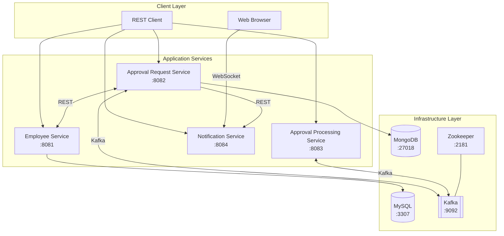
```mermaid
flowchart TB
    subgraph client[Client Layer]
        browser[Web Browser]
        rest_client[REST Client]
    end

    subgraph apps[Application Services]
        employee[Employee Service<br/>:8081]
        approval_req[Approval Request Service<br/>:8082]
        approval_proc[Approval Processing Service<br/>:8083]
        notification[Notification Service<br/>:8084]
    end

    subgraph infra[Infrastructure Layer]
        mysql[(MySQL<br/>:3307)]
        mongodb[(MongoDB<br/>:27018)]
        kafka[[Kafka<br/>:9092]]
        zookeeper[Zookeeper<br/>:2181]
    end

    rest_client --> employee
    rest_client --> approval_req
    rest_client --> approval_proc
    rest_client --> notification
    browser -->|WebSocket| notification

    employee --> mysql
    approval_req --> mongodb
    approval_req <-->|REST| employee
    approval_req -->|REST| notification
    approval_req <-->|Kafka| kafka
    approval_proc <-->|Kafka| kafka
    zookeeper --- kafka
```

**서비스 포트 정보**:
- Employee Service: 8081
- Approval Request Service: 8082
- Approval Processing Service: 8083
- Notification Service: 8084

### 1.2 아키텍처 개요

이 시스템은 **마이크로서비스 아키텍처(MSA)** 기반의 ERP 결재 시스템으로, 4개의 독립적인 Spring Boot 서비스로 구성되어 있다.

#### **핵심 설계 원칙**
- **서비스 독립성**: 각 서비스는 독립적으로 배포 및 확장 가능
- **비동기 통신**: Kafka를 통한 이벤트 기반 아키텍처로 서비스 간 결합도 최소화
- **다중 통신 프로토콜**: REST, gRPC, WebSocket, Kafka를 상황에 맞게 활용
- **데이터 저장소 다양화**: MySQL(관계형), MongoDB(문서형)를 용도에 맞게 선택

### 1.3 서비스별 상세 설명

#### **1.3.1 Employee Service (직원 관리 서비스)**
- **포트**: 8081
- **데이터베이스**: MySQL (erp_employee)
- **주요 기능**:
  - 직원 정보 CRUD (생성, 조회, 수정, 삭제)
  - 조직도 관리 (계층 구조)
  - 직원 존재 여부 검증
  - 부서/직급별 필터링
- **통신 방식**: REST API
- **역할**: 다른 서비스에서 직원 정보를 검증하고 조회하는 중앙 저장소

#### **1.3.2 Approval Request Service (결재 요청 서비스)**
- **포트**: 8082
- **데이터베이스**: MongoDB (erp_approval)
- **주요 기능**:
  - 결재 요청 생성 및 조회
  - 결재 진행 상태 관리
  - 결재 결과 처리 (Kafka Consumer)
  - 결재 통계 대시보드
  - 결재 의견(코멘트) 관리
- **통신 방식**: 
  - REST API (클라이언트 ↔ 서비스)
  - Kafka Producer (서비스 → Processing Service)
  - Kafka Consumer (Processing Service → 서비스)
  - REST Client (Employee Service, Notification Service 호출)
- **역할**: 결재 요청의 생명주기를 관리하는 핵심 서비스

#### **1.3.3 Approval Processing Service (결재 처리 서비스)**
- **포트**: 8083
- **데이터 저장소**: In-Memory (ConcurrentHashMap)
- **주요 기능**:
  - 결재자별 대기 목록 관리
  - 결재 승인/반려 처리
  - Kafka를 통한 결재 요청 수신 및 결과 전송
- **통신 방식**:
  - REST API (결재자의 대기 목록 조회 및 처리)
  - Kafka Consumer (Request Service → 결재 요청 수신)
  - Kafka Producer (Request Service → 결재 결과 전송)
- **역할**: 결재자의 실시간 대기 목록을 관리하고 빠른 조회 성능 제공

#### **1.3.4 Notification Service (알림 서비스)**
- **포트**: 8084
- **데이터 저장소**: In-Memory (WebSocket Session)
- **주요 기능**:
  - 실시간 알림 전송 (WebSocket)
  - 직원별 WebSocket 세션 관리
  - 연결 상태 모니터링
- **통신 방식**:
  - WebSocket (클라이언트 ↔ 서비스)
  - REST API (Approval Request Service에서 알림 요청 수신)
- **역할**: 결재 결과를 요청자에게 실시간으로 전달

### 1.4 인프라 계층

#### **1.4.1 MySQL**
- **버전**: 8.0
- **포트**: 3307 (호스트) → 3306 (컨테이너)
- **용도**: Employee Service의 직원 정보 저장
- **특징**: 
  - UTF-8 인코딩 (한글 지원)
  - 초기 데이터 자동 적재 (30명의 샘플 직원 데이터)
  - 조직도 계층 구조 (manager_id, level)

#### **1.4.2 MongoDB**
- **버전**: 7.0
- **포트**: 27018 (호스트) → 27017 (컨테이너)
- **용도**: Approval Request Service의 결재 문서 저장
- **특징**:
  - 스키마 유연성 (결재 단계 수 가변)
  - JSON 형태의 결재 단계 배열 저장
  - 빠른 쿼리 성능

#### **1.4.3 Kafka + Zookeeper**
- **Kafka 버전**: 7.5.0 (Confluent)
- **포트**: 
  - Kafka: 9092 (내부), 29092 (외부)
  - Zookeeper: 2181
- **용도**: 서비스 간 비동기 메시지 통신
- **토픽**:
  - `approval-request`: 결재 요청 전송 (Request → Processing)
  - `approval-result`: 결재 결과 전송 (Processing → Request)
- **특징**:
  - 서비스 간 느슨한 결합
  - 메시지 영속성 보장
  - 자동 토픽 생성 활성화

### 1.5 통신 프로토콜별 사용 목적

| 프로토콜 | 사용 위치 | 특징 | 선택 이유 |
|---------|----------|------|----------|
| **REST API** | 모든 서비스의 외부 인터페이스 | HTTP 기반, JSON 응답 | 표준화된 통신, 쉬운 디버깅 |
| **Kafka** | Approval Request ↔ Processing | 비동기 메시징 | 서비스 간 결합도 최소화, 확장성 |
| **WebSocket** | 클라이언트 ↔ Notification | 양방향 실시간 통신 | 즉각적인 알림 전달 |

### 1.6 데이터 흐름

#### **결재 요청 생성 흐름**
1. 클라이언트 → Approval Request Service (REST API)
2. Approval Request Service → Employee Service (직원 검증, REST API)
3. Approval Request Service → MongoDB (결재 문서 저장)
4. Approval Request Service → Kafka (approval-request 토픽에 메시지 발행)
5. Kafka → Approval Processing Service (메시지 소비)
6. Approval Processing Service → In-Memory (결재자별 대기 목록에 추가)

#### **결재 승인/반려 처리 흐름**
1. 클라이언트 → Approval Processing Service (REST API)
2. Approval Processing Service → Kafka (approval-result 토픽에 메시지 발행)
3. Kafka → Approval Request Service (메시지 소비)
4. Approval Request Service → MongoDB (결재 문서 상태 업데이트)
5. Approval Request Service → Notification Service (알림 요청, REST API)
6. Notification Service → 클라이언트 (WebSocket으로 실시간 알림)

### 1.7 확장성 및 가용성 고려사항

#### **수평 확장 가능 서비스**
- **Employee Service**: Stateless, MySQL 부하 분산 가능
- **Approval Request Service**: Stateless, MongoDB 샤딩 가능
- **Notification Service**: WebSocket 세션은 sticky session 필요

#### **병목 지점 및 해결 방안**
- **Kafka**: 파티션 증가로 처리량 향상
- **MongoDB**: 인덱스 최적화 (requestId, finalStatus)
- **In-Memory 저장소**: Redis로 전환 시 다중 인스턴스 지원 가능

### 1.8 보안 고려사항

#### **현재 구현**
- 서비스 간 내부 네트워크 통신 (Docker Network)
- 직원 ID 기반 인증 (단순화)

#### **프로덕션 환경 권장사항**
- JWT 기반 인증/인가
- API Gateway 도입 (인증 중앙화)
- TLS/SSL 암호화
- Kafka 메시지 암호화

### 1.9 모니터링 및 로깅

#### **Health Check**
- 모든 서비스에 Spring Boot Actuator `/actuator/health` 엔드포인트 제공
- Docker Compose의 healthcheck로 서비스 상태 모니터링

#### **로깅**
- SLF4J + Logback
- 주요 이벤트 로깅 (결재 생성, 승인, 반려)
- Kafka 메시지 송수신 로그

---

## 2. 서비스 간 호출 흐름도

### 2.1 결재 요청 생성 시퀀스

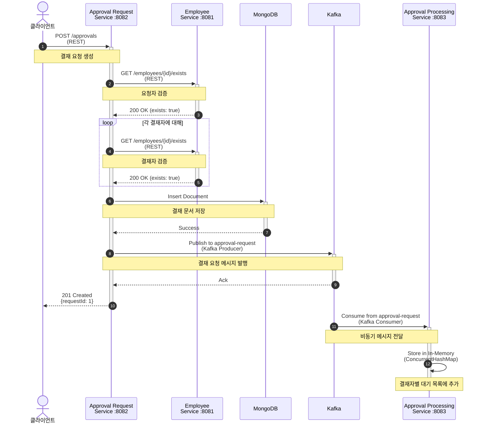
```mermaid
sequenceDiagram
    autonumber
    actor Client as 클라이언트
    participant ARS as Approval Request<br/>Service :8082
    participant ES as Employee<br/>Service :8081
    participant MDB as MongoDB
    participant Kafka as Kafka
    participant APS as Approval Processing<br/>Service :8083
    
    Client->>+ARS: POST /approvals<br/>(REST)
    Note over Client,ARS: 결재 요청 생성
    
    ARS->>+ES: GET /employees/{id}/exists<br/>(REST)
    Note over ARS,ES: 요청자 검증
    ES-->>-ARS: 200 OK (exists: true)
    
    loop 각 결재자에 대해
        ARS->>+ES: GET /employees/{id}/exists<br/>(REST)
        Note over ARS,ES: 결재자 검증
        ES-->>-ARS: 200 OK (exists: true)
    end
    
    ARS->>+MDB: Insert Document
    Note over ARS,MDB: 결재 문서 저장
    MDB-->>-ARS: Success
    
    ARS->>+Kafka: Publish to approval-request<br/>(Kafka Producer)
    Note over ARS,Kafka: 결재 요청 메시지 발행
    Kafka-->>-ARS: Ack
    
    ARS-->>-Client: 201 Created<br/>{requestId: 1}
    
    Kafka->>+APS: Consume from approval-request<br/>(Kafka Consumer)
    Note over Kafka,APS: 비동기 메시지 전달
    APS->>APS: Store in In-Memory<br/>(ConcurrentHashMap)
    Note over APS: 결재자별 대기 목록에 추가
    deactivate APS
```

### 2.2 결재 승인/반려 처리 시퀀스

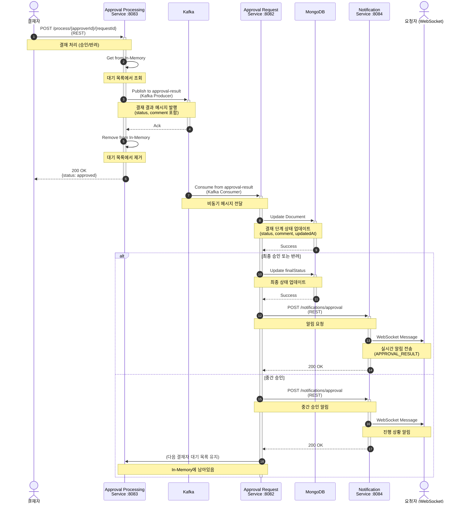
```mermaid
sequenceDiagram
    autonumber
    actor Approver as 결재자
    participant APS as Approval Processing<br/>Service :8083
    participant Kafka as Kafka
    participant ARS as Approval Request<br/>Service :8082
    participant MDB as MongoDB
    participant NS as Notification<br/>Service :8084
    actor Requester as 요청자 (WebSocket)
    
    Approver->>+APS: POST /process/{approverId}/{requestId}<br/>(REST)
    Note over Approver,APS: 결재 처리 (승인/반려)
    
    APS->>APS: Get from In-Memory
    Note over APS: 대기 목록에서 조회
    
    APS->>+Kafka: Publish to approval-result<br/>(Kafka Producer)
    Note over APS,Kafka: 결재 결과 메시지 발행<br/>(status, comment 포함)
    Kafka-->>-APS: Ack
    
    APS->>APS: Remove from In-Memory
    Note over APS: 대기 목록에서 제거
    
    APS-->>-Approver: 200 OK<br/>{status: approved}
    
    Kafka->>+ARS: Consume from approval-result<br/>(Kafka Consumer)
    Note over Kafka,ARS: 비동기 메시지 전달
    
    ARS->>+MDB: Update Document
    Note over ARS,MDB: 결재 단계 상태 업데이트<br/>(status, comment, updatedAt)
    MDB-->>-ARS: Success
    
    alt 최종 승인 또는 반려
        ARS->>+MDB: Update finalStatus
        Note over ARS,MDB: 최종 상태 업데이트
        MDB-->>-ARS: Success
        
        ARS->>+NS: POST /notifications/approval<br/>(REST)
        Note over ARS,NS: 알림 요청
        NS->>Requester: WebSocket Message
        Note over NS,Requester: 실시간 알림 전송<br/>(APPROVAL_RESULT)
        NS-->>-ARS: 200 OK
    else 중간 승인
        ARS->>+NS: POST /notifications/approval<br/>(REST)
        Note over ARS,NS: 중간 승인 알림
        NS->>Requester: WebSocket Message
        Note over NS,Requester: 진행 상황 알림
        NS-->>-ARS: 200 OK
        
        ARS->>APS: (다음 결재자 대기 목록 유지)
        Note over ARS,APS: In-Memory에 남아있음
    end
    
    deactivate ARS
```

### 2.3 WebSocket 연결 및 알림 수신 흐름

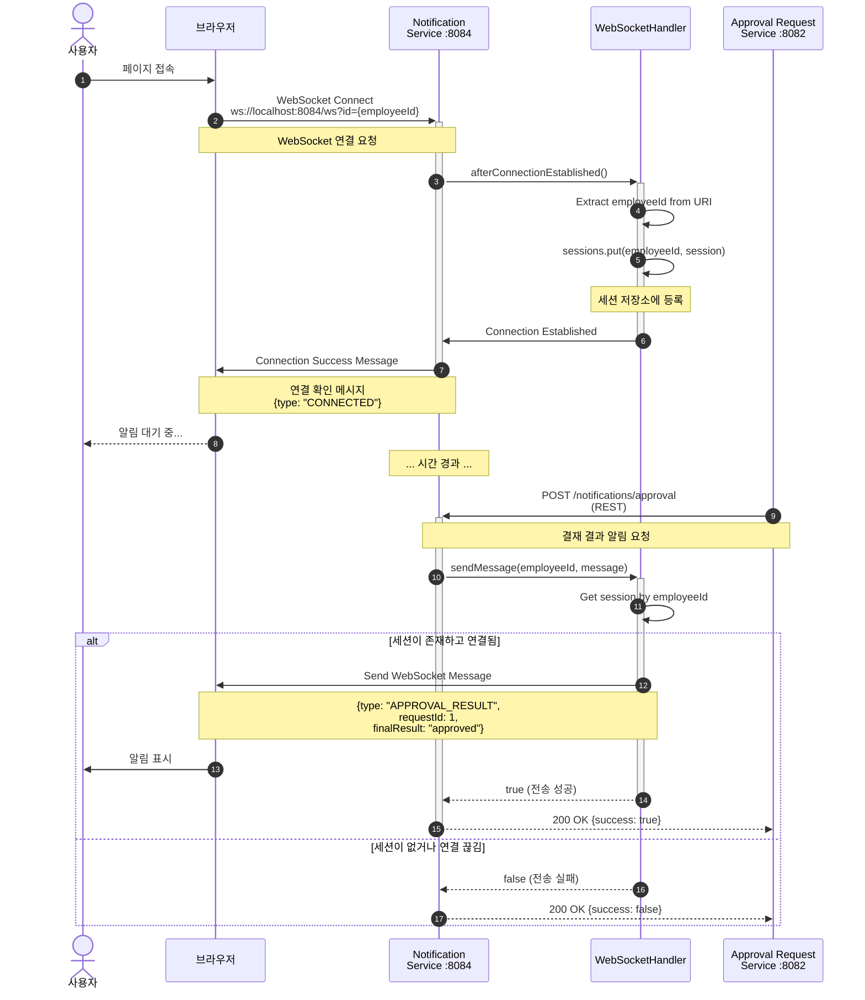
```mermaid
sequenceDiagram
    autonumber
    actor User as 사용자
    participant Browser as 브라우저
    participant NS as Notification<br/>Service :8084
    participant WSH as WebSocketHandler
    
    User->>Browser: 페이지 접속
    Browser->>+NS: WebSocket Connect<br/>ws://localhost:8084/ws?id={employeeId}
    Note over Browser,NS: WebSocket 연결 요청
    
    NS->>+WSH: afterConnectionEstablished()
    WSH->>WSH: Extract employeeId from URI
    WSH->>WSH: sessions.put(employeeId, session)
    Note over WSH: 세션 저장소에 등록
    
    WSH->>-NS: Connection Established
    NS->>-Browser: Connection Success Message
    Note over Browser,NS: 연결 확인 메시지<br/>{type: "CONNECTED"}
    
    Browser-->>User: 알림 대기 중...
    
    Note over NS: ... 시간 경과 ...
    
    participant ARS as Approval Request<br/>Service :8082
    ARS->>+NS: POST /notifications/approval<br/>(REST)
    Note over ARS,NS: 결재 결과 알림 요청
    
    NS->>+WSH: sendMessage(employeeId, message)
    WSH->>WSH: Get session by employeeId
    
    alt 세션이 존재하고 연결됨
        WSH->>Browser: Send WebSocket Message
        Note over WSH,Browser: {type: "APPROVAL_RESULT",<br/>requestId: 1,<br/>finalResult: "approved"}
        Browser->>User: 알림 표시
        WSH-->>-NS: true (전송 성공)
        NS-->>-ARS: 200 OK {success: true}
    else 세션이 없거나 연결 끊김
        WSH-->>NS: false (전송 실패)
        NS-->>ARS: 200 OK {success: false}
    end
```

### 2.4 결재 통계 조회 흐름

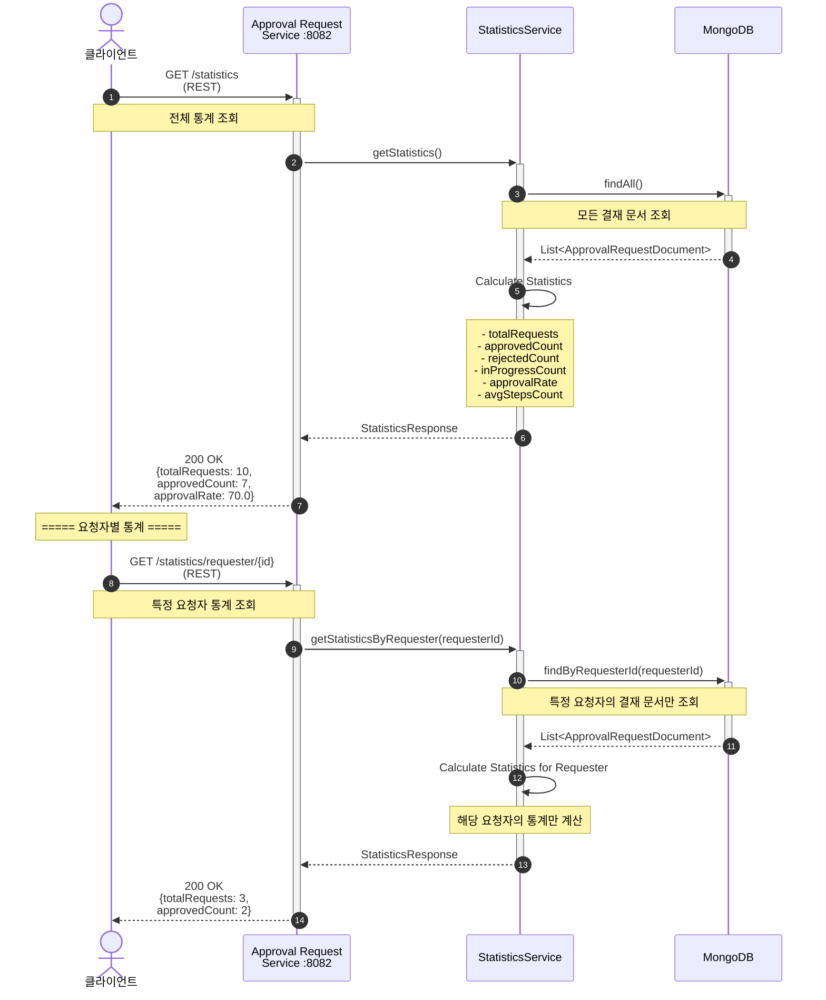
```mermaid
sequenceDiagram
    autonumber
    actor Client as 클라이언트
    participant ARS as Approval Request<br/>Service :8082
    participant SS as StatisticsService
    participant MDB as MongoDB
    
    Client->>+ARS: GET /statistics<br/>(REST)
    Note over Client,ARS: 전체 통계 조회
    
    ARS->>+SS: getStatistics()
    
    SS->>+MDB: findAll()
    Note over SS,MDB: 모든 결재 문서 조회
    MDB-->>-SS: List<ApprovalRequestDocument>
    
    SS->>SS: Calculate Statistics
    Note over SS: - totalRequests<br/>- approvedCount<br/>- rejectedCount<br/>- inProgressCount<br/>- approvalRate<br/>- avgStepsCount
    
    SS-->>-ARS: StatisticsResponse
    ARS-->>-Client: 200 OK<br/>{totalRequests: 10,<br/>approvedCount: 7,<br/>approvalRate: 70.0}
    
    Note over Client: ===== 요청자별 통계 =====
    
    Client->>+ARS: GET /statistics/requester/{id}<br/>(REST)
    Note over Client,ARS: 특정 요청자 통계 조회
    
    ARS->>+SS: getStatisticsByRequester(requesterId)
    
    SS->>+MDB: findByRequesterId(requesterId)
    Note over SS,MDB: 특정 요청자의 결재 문서만 조회
    MDB-->>-SS: List<ApprovalRequestDocument>
    
    SS->>SS: Calculate Statistics for Requester
    Note over SS: 해당 요청자의 통계만 계산
    
    SS-->>-ARS: StatisticsResponse
    ARS-->>-Client: 200 OK<br/>{totalRequests: 3,<br/>approvedCount: 2}
```

### 2.5 조직도 조회 흐름

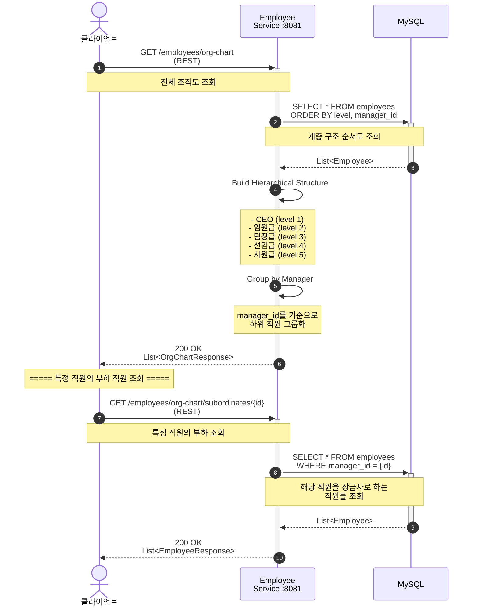
```mermaid
sequenceDiagram
    autonumber
    actor Client as 클라이언트
    participant ES as Employee<br/>Service :8081
    participant MySQL as MySQL
    
    Client->>+ES: GET /employees/org-chart<br/>(REST)
    Note over Client,ES: 전체 조직도 조회
    
    ES->>+MySQL: SELECT * FROM employees<br/>ORDER BY level, manager_id
    Note over ES,MySQL: 계층 구조 순서로 조회
    MySQL-->>-ES: List<Employee>
    
    ES->>ES: Build Hierarchical Structure
    Note over ES: - CEO (level 1)<br/>- 임원급 (level 2)<br/>- 팀장급 (level 3)<br/>- 선임급 (level 4)<br/>- 사원급 (level 5)
    
    ES->>ES: Group by Manager
    Note over ES: manager_id를 기준으로<br/>하위 직원 그룹화
    
    ES-->>-Client: 200 OK<br/>List<OrgChartResponse>
    
    Note over Client: ===== 특정 직원의 부하 직원 조회 =====
    
    Client->>+ES: GET /employees/org-chart/subordinates/{id}<br/>(REST)
    Note over Client,ES: 특정 직원의 부하 조회
    
    ES->>+MySQL: SELECT * FROM employees<br/>WHERE manager_id = {id}
    Note over ES,MySQL: 해당 직원을 상급자로 하는<br/>직원들 조회
    MySQL-->>-ES: List<Employee>
    
    ES-->>-Client: 200 OK<br/>List<EmployeeResponse>
```

### 2.6 통신 프로토콜 요약

| 통신 구간 | 프로토콜 | 용도 | 특징 |
|---------|---------|------|------|
| 클라이언트 → Employee Service | **REST** | 직원 CRUD, 조직도 조회 | 동기 호출, 즉시 응답 |
| 클라이언트 → Approval Request Service | **REST** | 결재 요청 생성, 조회, 통계 | 동기 호출, 즉시 응답 |
| 클라이언트 → Approval Processing Service | **REST** | 결재 승인/반려, 대기 목록 조회 | 동기 호출, 즉시 응답 |
| Approval Request → Employee | **REST** | 직원 존재 여부 검증 | 동기 호출, 검증 완료 후 진행 |
| Approval Request → Approval Processing | **Kafka** | 결재 요청 전달 | 비동기 메시징, 느슨한 결합 |
| Approval Processing → Approval Request | **Kafka** | 결재 결과 전달 | 비동기 메시징, 느슨한 결합 |
| Approval Request → Notification | **REST** | 알림 전송 요청 | 동기 호출, Fire-and-Forget |
| Notification → 클라이언트 | **WebSocket** | 실시간 알림 푸시 | 양방향 통신, 실시간 |

---

## 3. REST API 명세

### 3.1 Employee Service (포트 8081)

#### 직원 관리 API

| 메서드 | 엔드포인트 | 설명 | Request Body | Response |
|-------|----------|------|--------------|----------|
| **POST** | `/employees` | 직원 생성 | `EmployeeCreateRequest` | `201 Created` `EmployeeIdResponse` |
| **GET** | `/employees` | 직원 목록 조회 (필터링 지원) | - | `200 OK` `List<EmployeeResponse>` |
| **GET** | `/employees?department={dept}` | 부서별 직원 조회 | - | `200 OK` `List<EmployeeResponse>` |
| **GET** | `/employees?position={pos}` | 직급별 직원 조회 | - | `200 OK` `List<EmployeeResponse>` |
| **GET** | `/employees/{id}` | 직원 상세 조회 | - | `200 OK` `EmployeeResponse` |
| **GET** | `/employees/{id}/exists` | 직원 존재 여부 확인 | - | `200 OK` `boolean` |
| **PUT** | `/employees/{id}` | 직원 정보 수정 | `EmployeeUpdateRequest` | `200 OK` `EmployeeResponse` |
| **DELETE** | `/employees/{id}` | 직원 삭제 | - | `204 No Content` |

#### 조직도 API

| 메서드 | 엔드포인트 | 설명 | Request Body | Response |
|-------|----------|------|--------------|----------|
| **GET** | `/employees/org-chart` | 전체 조직도 조회 | - | `200 OK` `ListㄴOrgChartResponse>` |
| **GET** | `/employees/{id}/subordinates` | 특정 직원의 부하 직원 조회 | - | `200 OK` `List<EmployeeResponse>` |
| **GET** | `/employees/{id}/manager` | 특정 직원의 상급자 조회 | - | `200 OK` `EmployeeResponse` |

#### Request/Response DTO

**EmployeeCreateRequest**
```json
{
  "name": "홍길동",
  "department": "개발팀",
  "position": "백엔드 개발자",
  "email": "hong@company.com",
  "phoneNumber": "010-1234-5678",
  "hireDate": "2024-01-01",
  "birthDate": "1990-01-01",
  "address": "서울시 강남구",
  "emergencyContact": "010-9876-5432",
  "status": "ACTIVE",
  "managerId": 5,
  "level": 5
}
```

**EmployeeResponse**
```json
{
  "id": 1,
  "name": "홍길동",
  "department": "개발팀",
  "position": "백엔드 개발자",
  "email": "hong@company.com",
  "phoneNumber": "010-1234-5678",
  "hireDate": "2024-01-01",
  "createdAt": "2024-01-01T09:00:00"
}
```

### 3.2 Approval Request Service (포트 8082)

#### 결재 요청 API

| 메서드 | 엔드포인트 | 설명 | Request Body | Response |
|-------|----------|------|--------------|----------|
| **POST** | `/approvals` | 결재 요청 생성 | `ApprovalCreateRequest` | `201 Created` `ApprovalIdResponse` |
| **GET** | `/approvals` | 결재 요청 목록 조회 | - | `200 OK` `List<ApprovalResponse>` |
| **GET** | `/approvals/pending` | 진행 중인 결재 목록 조회 | - | `200 OK` `List<ApprovalRequestDocument>` |
| **GET** | `/approvals/{requestId}` | 결재 요청 상세 조회 | - | `200 OK` `ApprovalResponse` |

#### 결재 통계 API

| 메서드 | 엔드포인트 | 설명 | Request Body | Response |
|-------|----------|------|--------------|----------|
| **GET** | `/statistics` | 전체 결재 통계 조회 | - | `200 OK` `StatisticsResponse` |
| **GET** | `/statistics/requester/{requesterId}` | 특정 요청자의 통계 조회 | - | `200 OK` `StatisticsResponse` |

#### Request/Response DTO

**ApprovalCreateRequest**
```json
{
  "requesterId": 1,
  "title": "2024년 1분기 예산 승인 요청",
  "content": "개발팀 예산 1억원 승인 요청드립니다.",
  "steps": [
    {"step": 1, "approverId": 5},
    {"step": 2, "approverId": 2},
    {"step": 3, "approverId": 1}
  ]
}
```

**ApprovalResponse**
```json
{
  "requestId": 1,
  "requesterId": 1,
  "title": "2024년 1분기 예산 승인 요청",
  "content": "개발팀 예산 1억원 승인 요청드립니다.",
  "finalStatus": "in_progress",
  "steps": [
    {
      "step": 1,
      "approverId": 5,
      "status": "approved",
      "comment": "승인합니다.",
      "updatedAt": "2024-01-02T10:30:00"
    },
    {
      "step": 2,
      "approverId": 2,
      "status": "pending",
      "comment": null,
      "updatedAt": null
    }
  ],
  "createdAt": "2024-01-01T09:00:00",
  "updatedAt": "2024-01-02T10:30:00"
}
```

**StatisticsResponse**
```json
{
  "totalRequests": 100,
  "approvedCount": 70,
  "rejectedCount": 20,
  "inProgressCount": 10,
  "approvalRate": 70.0,
  "rejectionRate": 20.0,
  "avgStepsCount": 2.5,
  "requestsByEmployee": {
    "1": 15,
    "2": 20,
    "3": 10
  }
}
```

### 3.3 Approval Processing Service (포트 8083)

#### 결재 처리 API

| 메서드 | 엔드포인트 | 설명 | Request Body | Response |
|-------|----------|------|--------------|----------|
| **GET** | `/process/{approverId}` | 특정 결재자의 대기 목록 조회 | - | `200 OK` `List<PendingApproval>` |
| **POST** | `/process/{approverId}/{requestId}` | 결재 처리 (승인/반려) | `ProcessRequest` | `200 OK` `ProcessResponse` |

#### Request/Response DTO

**ProcessRequest**
```json
{
  "status": "approved",
  "comment": "검토 완료. 승인합니다."
}
```

**ProcessResponse**
```json
{
  "requestId": 1,
  "approverId": 5,
  "status": "approved",
  "message": "결재 처리가 완료되었습니다."
}
```

**PendingApproval**
```json
{
  "requestId": 1,
  "requesterId": 1,
  "title": "2024년 1분기 예산 승인 요청",
  "content": "개발팀 예산 1억원 승인 요청드립니다.",
  "steps": [
    {"step": 1, "approverId": 5, "status": "pending"}
  ]
}
```

### 3.4 Notification Service (포트 8084)

#### 알림 API

| 메서드 | 엔드포인트 | 설명 | Request Body | Response |
|-------|----------|------|--------------|----------|
| **POST** | `/notifications/approval` | 결재 결과 알림 전송 | `NotificationRequest` | `200 OK` `NotificationResponse` |
| **GET** | `/notifications/status/{employeeId}` | 직원 연결 상태 확인 | - | `200 OK` `{connected: boolean}` |
| **GET** | `/notifications/sessions` | 활성 세션 정보 조회 | - | `200 OK` `{activeSessions: number}` |

#### Request/Response DTO

**NotificationRequest**
```json
{
  "requestId": 1,
  "employeeId": 1,
  "result": "approved",
  "rejectedBy": null,
  "approvedBy": 5,
  "currentStep": 1,
  "totalSteps": 3,
  "finalResult": "in_progress"
}
```

**NotificationResponse**
```json
{
  "success": true,
  "employeeId": 1,
  "message": "알림이 성공적으로 전송되었습니다."
}
```

---

## 4. gRPC Proto 파일

### 4.1 approval.proto

본 시스템에서는 gRPC를 위한 proto 파일이 정의되어 있으나, 현재 구현에서는 REST API와 Kafka를 주로 사용하고 있다. Proto 파일은 향후 확장을 위해 준비되어 있다.

```protobuf
syntax = "proto3";

option java_multiple_files = true;
option java_package = "com.example.demo.grpc";
option java_outer_classname = "ApprovalProto";

package approval;

// Approval Processing Service와 통신하는 서비스
service ApprovalService {
    // 결재 요청 정보를 Processing Service로 전달
    rpc RequestApproval (ApprovalRequest) returns (ApprovalResponse);
    // Processing Service로부터 결재 결과를 전달받음
    rpc ReturnApprovalResult (ApprovalResultRequest) returns (ApprovalResultResponse);
    // Processing Service가 시작할 때 모든 pending 결재 목록 조회
    rpc GetAllPendingApprovals (EmptyRequest) returns (PendingApprovalsResponse);
}

message EmptyRequest {
}

message Step {
    int32 step = 1;
    int32 approverId = 2;
    string status = 3; // pending, approved, rejected
}

message ApprovalRequest {
    int32 requestId = 1;
    int32 requesterId = 2;
    string title = 3;
    string content = 4;
    repeated Step steps = 5;
}

message ApprovalResponse {
    string status = 1; // "received" 등 처리 상태
}

message ApprovalResultRequest {
    int32 requestId = 1;
    int32 step = 2;
    int32 approverId = 3;
    string status = 4; // approved or rejected
}

message ApprovalResultResponse {
    string status = 1;
}

message PendingApprovalsResponse {
    repeated ApprovalRequest approvals = 1;
}
```

### 4.2 Proto 파일 설명

#### **service ApprovalService**
- `RequestApproval`: 결재 요청을 Processing Service로 전달하는 RPC
- `ReturnApprovalResult`: Processing Service로부터 결재 결과를 받는 RPC
- `GetAllPendingApprovals`: 시스템 시작 시 동기화를 위한 RPC

#### **message 타입**
- `ApprovalRequest`: 결재 요청 정보 (requestId, requesterId, title, content, steps)
- `Step`: 결재 단계 정보 (step, approverId, status)
- `ApprovalResultRequest`: 결재 결과 정보 (requestId, step, approverId, status)

### 4.3 현재 구현 상태

현재 시스템에서는 **gRPC 대신 Kafka**를 사용하여 서비스 간 비동기 통신을 구현했다. gRPC는 다음과 같은 이유로 Kafka로 대체되었다:

- **비동기 처리**: Kafka의 메시지 큐 방식이 결재 처리 흐름에 더 적합
- **느슨한 결합**: 서비스 간 직접 호출 없이 메시지 기반 통신
- **확장성**: Kafka의 파티셔닝과 컨슈머 그룹으로 수평 확장 용이
- **내구성**: 메시지 영속성으로 장애 복구 가능

---

## 5. MySQL 스키마

### 5.1 데이터베이스 정보

- **데이터베이스명**: `erp_employee`
- **캐릭터셋**: UTF-8 (utf8mb4)
- **Collation**: utf8mb4_unicode_ci
- **용도**: Employee Service의 직원 정보 저장

### 5.2 employees 테이블

```sql
CREATE TABLE employees (
    id BIGINT PRIMARY KEY AUTO_INCREMENT,
    name VARCHAR(100) NOT NULL,
    department VARCHAR(100) NOT NULL,
    position VARCHAR(100) NOT NULL,
    email VARCHAR(100),
    phone_number VARCHAR(20),
    hire_date DATE,
    birth_date DATE,
    address VARCHAR(200),
    emergency_contact VARCHAR(100),
    status VARCHAR(20) DEFAULT 'ACTIVE',
    profile_image_url VARCHAR(500),
    manager_id BIGINT,
    level INT,
    created_at DATETIME DEFAULT CURRENT_TIMESTAMP,
    FOREIGN KEY (manager_id) REFERENCES employees(id) ON DELETE SET NULL
) CHARACTER SET utf8mb4 COLLATE utf8mb4_unicode_ci;
```

### 5.3 컬럼 설명

| 컬럼명 | 타입 | 제약조건 | 설명 |
|-------|------|---------|------|
| `id` | BIGINT | PRIMARY KEY, AUTO_INCREMENT | 직원 고유 ID |
| `name` | VARCHAR(100) | NOT NULL | 직원 이름 |
| `department` | VARCHAR(100) | NOT NULL | 소속 부서 |
| `position` | VARCHAR(100) | NOT NULL | 직급/직책 |
| `email` | VARCHAR(100) | - | 이메일 주소 |
| `phone_number` | VARCHAR(20) | - | 휴대폰 번호 |
| `hire_date` | DATE | - | 입사일 |
| `birth_date` | DATE | - | 생년월일 |
| `address` | VARCHAR(200) | - | 주소 |
| `emergency_contact` | VARCHAR(100) | - | 비상 연락처 |
| `status` | VARCHAR(20) | DEFAULT 'ACTIVE' | 재직 상태 (ACTIVE, ON_LEAVE, RESIGNED) |
| `profile_image_url` | VARCHAR(500) | - | 프로필 이미지 URL |
| `manager_id` | BIGINT | FOREIGN KEY | 상급자 ID (self-reference) |
| `level` | INT | - | 조직 계층 레벨 (1=CEO, 2=임원, 3=팀장, 4=선임, 5=사원) |
| `created_at` | DATETIME | DEFAULT CURRENT_TIMESTAMP | 등록일시 |

### 5.4 조직도 계층 구조

```
Level 1: CEO (대표이사)
├─ Level 2: CTO (기술이사)
│  ├─ Level 3: 백엔드팀장
│  │  ├─ Level 4: 백엔드 선임개발자
│  │  └─ Level 5: 백엔드 개발자
│  ├─ Level 3: 프론트팀장
│  │  ├─ Level 4: 프론트 선임개발자
│  │  └─ Level 5: 프론트 개발자
│  └─ Level 3: 인프라팀장
│     └─ Level 4: 인프라 선임엔지니어
├─ Level 2: CFO (재무이사)
│  ├─ Level 3: 회계팀장
│  └─ Level 3: 재무팀장
└─ Level 2: CHRO (인사이사)
   ├─ Level 3: 인사팀장
   └─ Level 3: 총무팀장
```

### 5.5 샘플 데이터

초기 데이터로 30명의 직원 정보가 자동으로 적재된다:

- **Level 1**: CEO 1명
- **Level 2**: CTO, CFO, CHRO 3명
- **Level 3**: 각 본부 산하 팀장 7명
- **Level 4**: 선임급 7명
- **Level 5**: 사원급 10명
- **특수 상태**: 휴직자 1명, 퇴사자 1명

### 5.6 인덱스 및 성능 최적화

```sql
-- Primary Key Index (자동 생성)
CREATE INDEX idx_employees_pk ON employees(id);

-- 부서별 조회 최적화
CREATE INDEX idx_employees_department ON employees(department);

-- 직급별 조회 최적화
CREATE INDEX idx_employees_position ON employees(position);

-- 조직도 조회 최적화 (상급자 기준)
CREATE INDEX idx_employees_manager ON employees(manager_id);

-- 조직도 계층 조회 최적화
CREATE INDEX idx_employees_level ON employees(level);

-- 복합 인덱스 (부서 + 직급)
CREATE INDEX idx_employees_dept_pos ON employees(department, position);
```

---

## 6. MongoDB 문서 구조

### 6.1 데이터베이스 정보

- **데이터베이스명**: `erp_approval`
- **컬렉션명**: `approval_requests`
- **용도**: Approval Request Service의 결재 문서 저장

### 6.2 ApprovalRequestDocument 구조

```json
{
  "_id": "507f1f77bcf86cd799439011",
  "requestId": 1,
  "requesterId": 15,
  "title": "2024년 1분기 개발팀 예산 승인 요청",
  "content": "개발팀 운영 예산 1억원 승인 요청드립니다. 주요 사용처는 클라우드 인프라 비용, 개발 도구 라이센스, 교육비입니다.",
  "steps": [
    {
      "step": 1,
      "approverId": 5,
      "status": "approved",
      "comment": "예산 내역 확인했습니다. 승인합니다.",
      "updatedAt": "2024-01-02T10:30:00"
    },
    {
      "step": 2,
      "approverId": 2,
      "status": "approved",
      "comment": "기술본부 검토 완료. 승인합니다.",
      "updatedAt": "2024-01-02T14:20:00"
    },
    {
      "step": 3,
      "approverId": 1,
      "status": "pending",
      "comment": null,
      "updatedAt": null
    }
  ],
  "finalStatus": "in_progress",
  "createdAt": "2024-01-01T09:00:00",
  "updatedAt": "2024-01-02T14:20:00"
}
```

### 6.3 필드 설명

| 필드명 | 타입 | 설명 |
|-------|------|------|
| `_id` | ObjectId | MongoDB 자동 생성 고유 ID |
| `requestId` | Long | 결재 요청 번호 (비즈니스 키) |
| `requesterId` | Long | 요청자 직원 ID |
| `title` | String | 결재 요청 제목 |
| `content` | String | 결재 요청 내용 |
| `steps` | Array<ApprovalStep> | 결재 단계 배열 |
| `finalStatus` | String | 최종 상태 (in_progress, approved, rejected) |
| `createdAt` | DateTime | 생성일시 |
| `updatedAt` | DateTime | 수정일시 |

### 6.4 ApprovalStep 서브 문서 구조

```json
{
  "step": 1,
  "approverId": 5,
  "status": "approved",
  "comment": "검토 완료. 승인합니다.",
  "updatedAt": "2024-01-02T10:30:00"
}
```

| 필드명 | 타입 | 설명 |
|-------|------|------|
| `step` | Integer | 결재 단계 번호 (1부터 시작) |
| `approverId` | Long | 결재자 직원 ID |
| `status` | String | 결재 상태 (pending, approved, rejected) |
| `comment` | String | 결재 의견/코멘트 |
| `updatedAt` | DateTime | 결재 처리 일시 |

### 6.5 finalStatus 값

| 값 | 설명 |
|----|------|
| `in_progress` | 결재 진행 중 (아직 모든 단계가 완료되지 않음) |
| `approved` | 최종 승인 (모든 단계가 approved) |
| `rejected` | 반려됨 (하나 이상의 단계가 rejected) |

### 6.6 인덱스

```javascript
// requestId에 대한 고유 인덱스
db.approval_requests.createIndex({ "requestId": 1 }, { unique: true });

// finalStatus 기반 조회 최적화
db.approval_requests.createIndex({ "finalStatus": 1 });

// 요청자별 조회 최적화
db.approval_requests.createIndex({ "requesterId": 1 });

// 생성일시 기반 정렬 최적화
db.approval_requests.createIndex({ "createdAt": -1 });

// 복합 인덱스 (요청자 + 상태)
db.approval_requests.createIndex({ "requesterId": 1, "finalStatus": 1 });
```

### 6.7 쿼리 예시

#### 진행 중인 결재 조회
```javascript
db.approval_requests.find({ "finalStatus": "in_progress" });
```

#### 특정 요청자의 결재 조회
```javascript
db.approval_requests.find({ "requesterId": 15 });
```

#### 특정 결재 단계 업데이트
```javascript
db.approval_requests.updateOne(
  { "requestId": 1, "steps.step": 1 },
  { 
    $set: { 
      "steps.$.status": "approved",
      "steps.$.comment": "승인합니다.",
      "steps.$.updatedAt": new Date(),
      "updatedAt": new Date()
    }
  }
);
```

---

## 7. WebSocket 메시지 구조

### 7.1 WebSocket 연결

#### 연결 URL
```
ws://localhost:8084/ws?id={employeeId}
```

- **프로토콜**: WebSocket
- **포트**: 8084 (Notification Service)
- **파라미터**: `id` (직원 ID, 필수)

#### 연결 예시 (JavaScript)
```javascript
const employeeId = 1;
const ws = new WebSocket(`ws://localhost:8084/ws?id=${employeeId}`);

ws.onopen = function(event) {
  console.log('WebSocket 연결 성공');
};

ws.onmessage = function(event) {
  const message = JSON.parse(event.data);
  console.log('알림 수신:', message);
};

ws.onerror = function(error) {
  console.error('WebSocket 에러:', error);
};

ws.onclose = function(event) {
  console.log('WebSocket 연결 종료');
};
```

### 7.2 메시지 타입

#### 7.2.1 연결 확인 메시지 (CONNECTED)

서버에서 클라이언트로 전송되는 연결 성공 메시지

```json
{
  "type": "CONNECTED",
  "message": "WebSocket 연결이 성공적으로 설정되었습니다.",
  "employeeId": 1,
  "timestamp": "2024-01-01T09:00:00"
}
```

#### 7.2.2 결재 결과 알림 (APPROVAL_RESULT)

##### 최종 승인 시
```json
{
  "type": "APPROVAL_RESULT",
  "requestId": 1,
  "result": "approved",
  "rejectedBy": null,
  "approvedBy": 1,
  "currentStep": 3,
  "totalSteps": 3,
  "finalResult": "approved",
  "message": "결재 요청 #1이(가) 최종 승인되었습니다."
}
```

##### 반려 시
```json
{
  "type": "APPROVAL_RESULT",
  "requestId": 1,
  "result": "rejected",
  "rejectedBy": 2,
  "approvedBy": null,
  "currentStep": 2,
  "totalSteps": 3,
  "finalResult": "rejected",
  "message": "결재 요청 #1이(가) 결재자 2에 의해 반려되었습니다."
}
```

##### 중간 승인 시
```json
{
  "type": "APPROVAL_RESULT",
  "requestId": 1,
  "result": "approved",
  "rejectedBy": null,
  "approvedBy": 5,
  "currentStep": 1,
  "totalSteps": 3,
  "finalResult": "in_progress",
  "message": "결재 요청 #1: 결재자 5가 승인했습니다. (1/3 단계 완료)"
}
```

### 7.3 NotificationMessage 필드 설명

| 필드명 | 타입 | 필수 | 설명 |
|-------|------|------|------|
| `type` | String | O | 메시지 타입 (CONNECTED, APPROVAL_RESULT) |
| `requestId` | Long | O | 결재 요청 ID |
| `result` | String | O | 단계별 결과 (approved, rejected) |
| `rejectedBy` | Long | X | 반려한 결재자 ID (반려 시에만) |
| `approvedBy` | Long | X | 승인한 결재자 ID (승인 시에만) |
| `currentStep` | Integer | O | 현재 완료된 단계 번호 |
| `totalSteps` | Integer | O | 전체 단계 수 |
| `finalResult` | String | O | 최종 결과 (approved, rejected, in_progress) |
| `message` | String | O | 사용자 친화적 메시지 |

### 7.4 클라이언트 메시지 처리 예시

```javascript
ws.onmessage = function(event) {
  const notification = JSON.parse(event.data);
  
  switch(notification.type) {
    case 'CONNECTED':
      console.log('연결됨:', notification.message);
      showToast('알림 서비스에 연결되었습니다.', 'success');
      break;
      
    case 'APPROVAL_RESULT':
      handleApprovalResult(notification);
      break;
      
    default:
      console.warn('알 수 없는 메시지 타입:', notification.type);
  }
};

function handleApprovalResult(notification) {
  const { requestId, finalResult, message, currentStep, totalSteps } = notification;
  
  if (finalResult === 'approved') {
    // 최종 승인
    showNotification(`✅ ${message}`, 'success');
    playSound('approval');
  } else if (finalResult === 'rejected') {
    // 반려
    showNotification(`❌ ${message}`, 'error');
    playSound('rejection');
  } else if (finalResult === 'in_progress') {
    // 중간 승인
    showNotification(`⏳ ${message}`, 'info');
    updateProgressBar(currentStep, totalSteps);
  }
  
  // UI 업데이트
  refreshApprovalList();
}
```

### 7.5 세션 관리

#### 세션 저장소
- **타입**: `ConcurrentHashMap<Long, WebSocketSession>`
- **키**: 직원 ID (employeeId)
- **값**: WebSocketSession 객체

#### 세션 생명주기
1. **연결 시**: `sessions.put(employeeId, session)`
2. **알림 전송 시**: `sessions.get(employeeId).sendMessage(textMessage)`
3. **연결 해제 시**: `sessions.remove(employeeId)`

#### 중복 연결 처리
- 같은 직원 ID로 새 연결이 들어오면 기존 세션을 종료하고 새 세션으로 교체
- 이를 통해 하나의 직원 ID는 하나의 활성 WebSocket 연결만 유지

### 7.6 에러 처리

#### 연결 실패
```json
{
  "type": "ERROR",
  "message": "Missing 'id' parameter",
  "code": "BAD_DATA"
}
```

#### 세션 타임아웃
- 일정 시간 동안 통신이 없으면 자동으로 연결 종료
- 클라이언트는 재연결 로직 구현 필요

```javascript
let reconnectInterval = null;

ws.onclose = function(event) {
  console.log('WebSocket 연결 종료. 5초 후 재연결 시도...');
  reconnectInterval = setTimeout(() => {
    connectWebSocket(employeeId);
  }, 5000);
};
```

---

## 8. 실행 방법

### 8.1 사전 요구사항

#### **필수 설치 항목**
- **Docker**: 20.10 이상
- **Docker Compose**: 2.0 이상
- **JDK**: 17 이상 (로컬 빌드 시)
- **Gradle**: 8.14.3 (로컬 빌드 시)

#### **권장 사항**
- **메모리**: 최소 8GB RAM
- **디스크**: 최소 10GB 여유 공간
- **OS**: Windows 10/11, macOS, Linux

### 8.2 Docker Compose를 이용한 실행 (권장)

#### **8.2.1 전체 시스템 실행**

```powershell
# 프로젝트 루트 디렉토리로 이동
cd <루트 디렉토리>

# Docker Compose로 전체 시스템 실행
# 이미 Docker Hub에 이미지가 업로드되어 있으므로 --build는 선택사항
docker compose up -d

# 로컬에서 이미지를 새로 빌드하려면 --build 옵션 추가
docker compose up -d --build
```

**실행되는 서비스:**
- MySQL (포트 3307)
- MongoDB (포트 27018)
- Zookeeper (포트 2181)
- Kafka (포트 9092, 29092)
- Employee Service (포트 8081)
- Approval Request Service (포트 8082)
- Approval Processing Service (포트 8083)
- Notification Service (포트 8084)

#### **8.2.2 실행 상태 확인**

```powershell
# 모든 컨테이너 상태 확인
docker compose ps

# 특정 서비스 로그 확인
docker compose logs -f employee-service
docker compose logs -f approval-request-service
docker compose logs -f approval-processing-service
docker compose logs -f notification-service

# 모든 서비스 로그 확인
docker compose logs -f
```

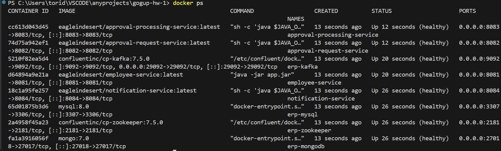

#### **8.2.3 Health Check 확인**

```powershell
# Employee Service
curl http://localhost:8081/actuator/health

# Approval Request Service
curl http://localhost:8082/actuator/health

# Approval Processing Service
curl http://localhost:8083/actuator/health

# Notification Service
curl http://localhost:8084/actuator/health
```

**예상 응답:**
```json
{
  "status": "UP"
}
```

#### **8.2.4 시스템 중지**

```powershell
# 모든 서비스 중지
docker compose down

# 볼륨까지 삭제 (데이터 초기화)
docker compose down -v

# 이미지까지 삭제
docker compose down --rmi all
```

### 8.3 환경 설정

#### **8.3.1 Docker 환경 설정 (application-docker.properties)**

각 서비스의 `src/main/resources/application-docker.properties` 파일:

**Employee Service:**
```properties
spring.datasource.url=jdbc:mysql://mysql:3306/erp_employee
spring.datasource.username=erp_user
spring.datasource.password=erp_password
server.port=8081
```

**Approval Request Service:**
```properties
spring.data.mongodb.uri=mongodb://mongodb:27017/erp_approval
spring.kafka.bootstrap-servers=kafka:9092
server.port=8082
```

**Approval Processing Service:**
```properties
spring.kafka.bootstrap-servers=kafka:9092
server.port=8083
```

**Notification Service:**
```properties
server.port=8084
```

~~### 8.4 Kubernetes 배포 (미구현)~~

~~#### 8.4.1 이미지 빌드 및 푸시~~

```powershell
# Docker Hub에 이미지 푸시
.\scripts\push-to-dockerhub.ps1
```

~~#### 8.4.2 Kubernetes 클러스터 배포~~

```powershell
# 전체 배포
.\k8s\deploy-k8s.ps1

# 개별 배포
kubectl apply -f k8s/namespace.yaml
kubectl apply -f k8s/mysql.yaml
kubectl apply -f k8s/mongodb.yaml
kubectl apply -f k8s/zookeeper.yaml
kubectl apply -f k8s/kafka.yaml
kubectl apply -f k8s/employee-service.yaml
kubectl apply -f k8s/approval-request-service.yaml
kubectl apply -f k8s/approval-processing-service.yaml
kubectl apply -f k8s/notification-service.yaml
```

---

## 9. 테스트 시나리오

### 9.1 기본 기능 테스트

#### **9.1.1 직원 정보 조회 (Employee Service)**

**시나리오**: 초기 데이터로 적재된 30명의 직원 목록을 조회한다.

```powershell
# 전체 직원 목록 조회
curl http://localhost:8081/employees

# 특정 직원 조회 (ID: 1 - CEO)
curl http://localhost:8081/employees/1

# 부서별 조회 (개발팀)
curl http://localhost:8081/employees?department=개발팀

# 직급별 조회 (팀장)
curl "http://localhost:8081/employees?position=백엔드팀장"
```

**예상 결과**:
- 전체 조회: 30명의 직원 데이터 반환
- 특정 직원: CEO 김대표 정보 반환
- 부서별: 개발팀 소속 직원만 반환
- 직급별: 팀장급 직원만 반환

**검증 포인트**:
- ✅ 200 OK 응답
- ✅ JSON 형식의 데이터
- ✅ 한글 인코딩 정상 처리
- ✅ 필터링 조건 정확성

- 전체 직원 목록 조회 화면
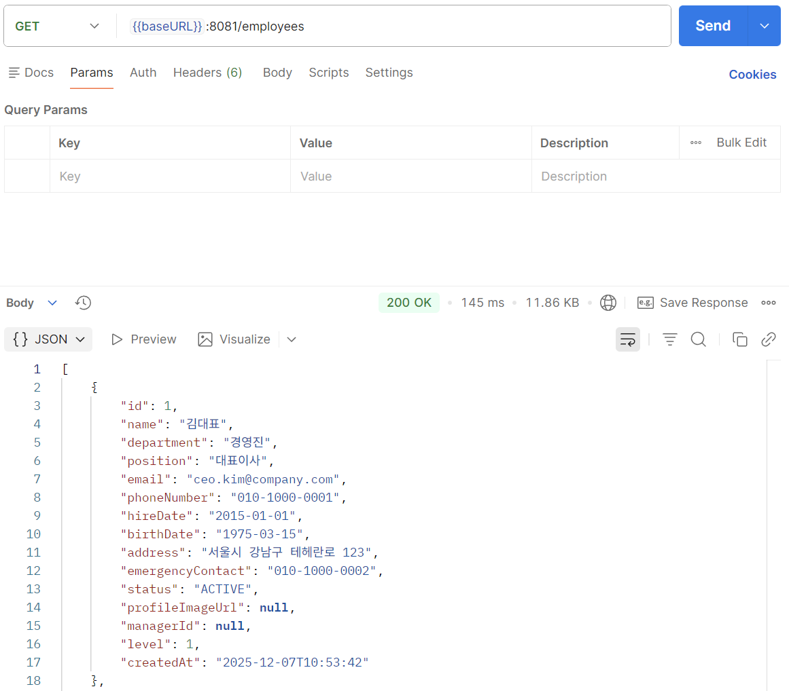

- 개발팀 직원 목록 조회 화면
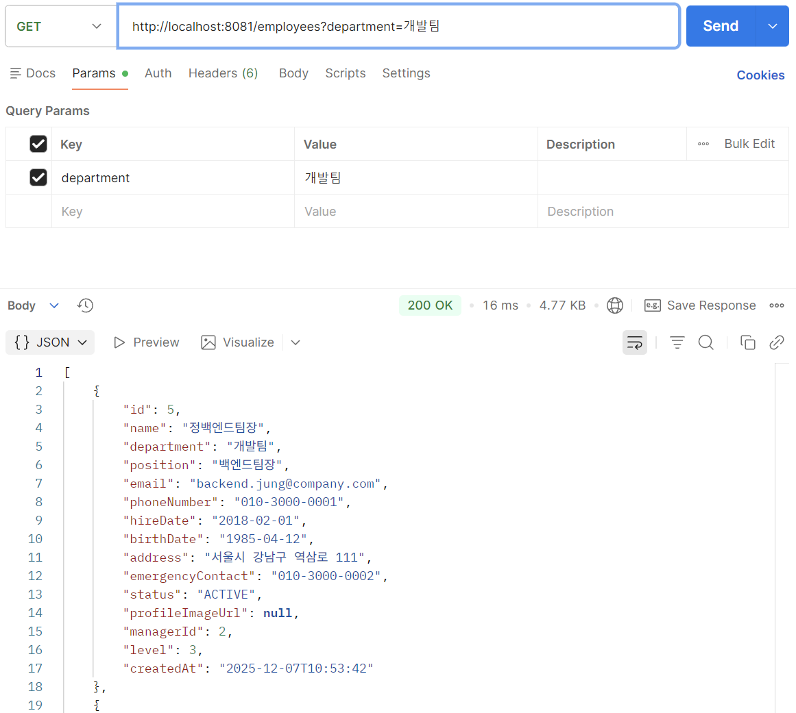

#### **9.1.2 조직도 조회 (Employee Service)**

**시나리오**: 전체 조직도 계층 구조를 조회한다.

```powershell
# 전체 조직도 조회
curl http://localhost:8081/employees/org-chart

# 특정 직원의 부하 직원 조회 (CTO의 부하)
curl http://localhost:8081/employees/2/subordinates

# 특정 직원의 상급자 조회 (백엔드팀장의 상급자)
curl http://localhost:8081/employees/5/manager
```

**예상 결과**:
- 전체 조직도: CEO → 임원 → 팀장 → 선임 → 사원 계층 구조
- 부하 직원: CTO 산하 백엔드팀장, 프론트팀장, 인프라팀장 반환
- 상급자: CTO 정보 반환

**검증 포인트**:
- ✅ 계층 구조 정확성 (level 1~5)
- ✅ manager_id 관계 정확성
- ✅ subordinates 배열 재귀적 구조

- 조직도 조회 화면
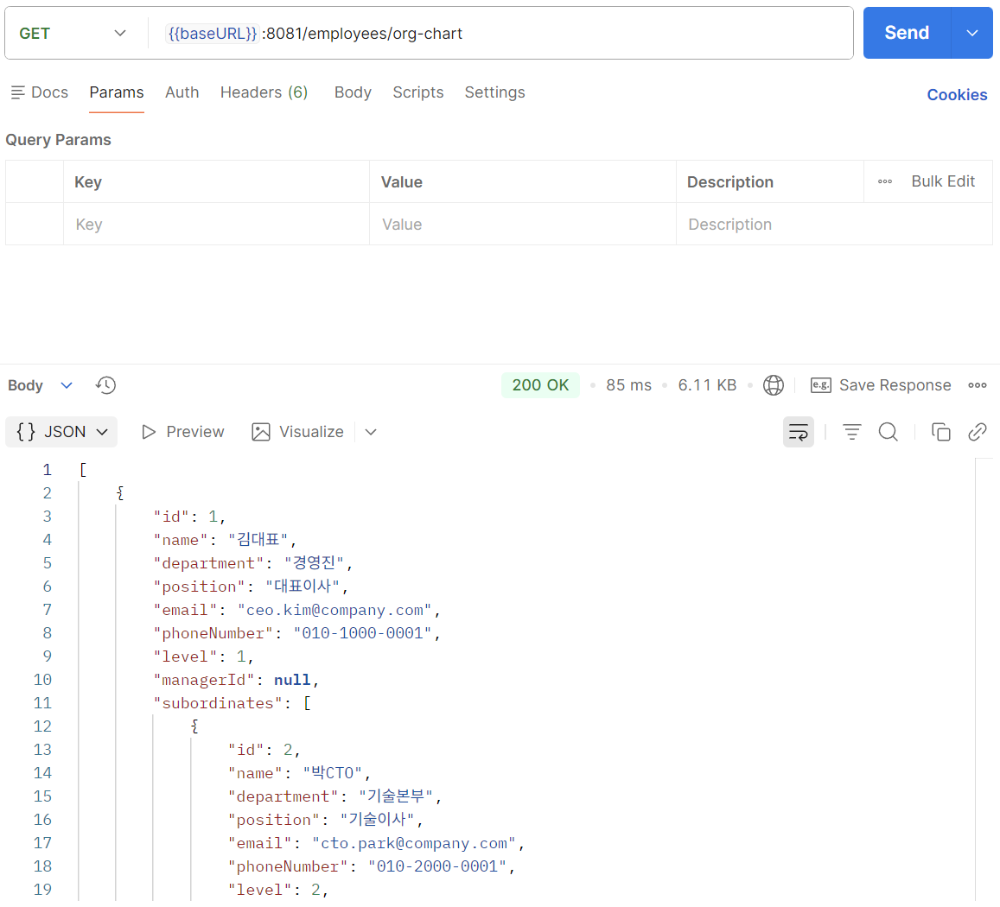

- 5번 직원의 상사 조회 화면
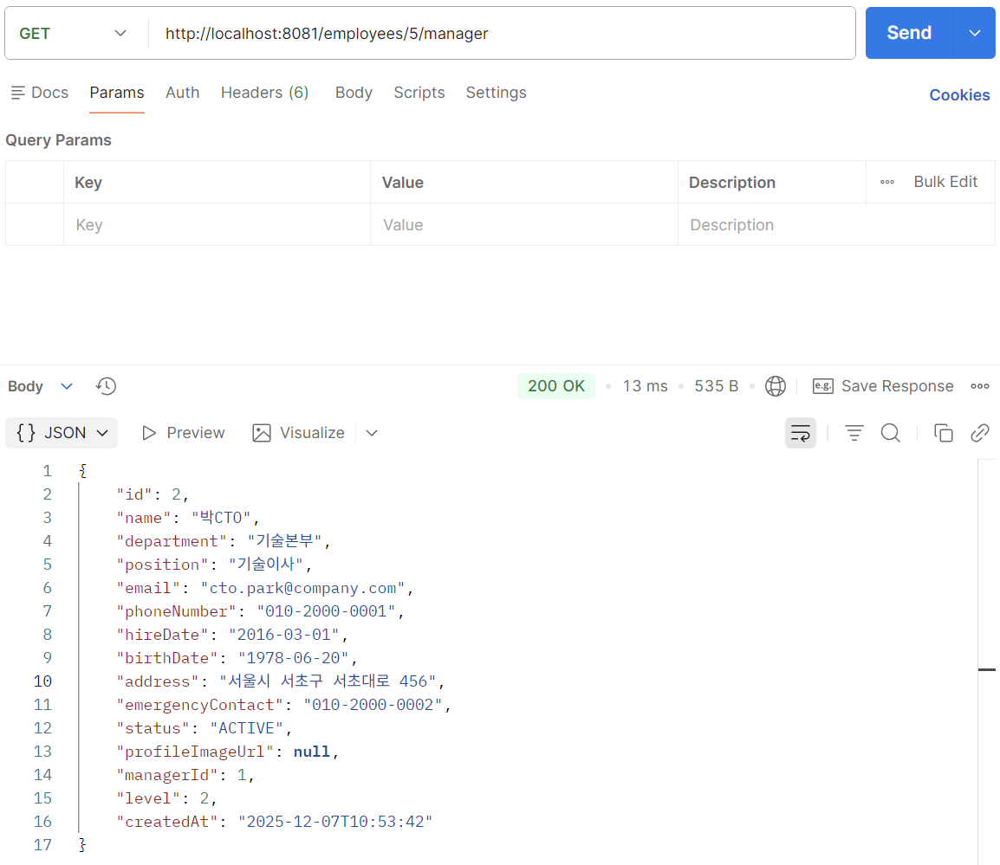

### 9.2 결재 요청 생성 테스트

#### **9.2.1 단일 결재자 결재 요청**

**시나리오**: 1단계 결재 요청을 생성한다.

```powershell
curl -X POST http://localhost:8082/approvals `
  -H "Content-Type: application/json" `
  -d '{
    "requesterId": 15,
    "title": "노트북 구매 승인 요청",
    "content": "업무용 노트북 구매 승인 요청드립니다. (예상 금액: 200만원)",
    "steps": [
      {"step": 1, "approverId": 5}
    ]
  }'
```

**예상 결과**:
```json
{
  "requestId": 1
}
```

**검증 포인트**:
- ✅ 201 Created 응답
- ✅ MongoDB에 문서 저장 확인
- ✅ Kafka approval-request 토픽에 메시지 발행
- ✅ Approval Processing Service의 In-Memory에 추가

**Kafka 메시지 확인**:
```powershell
docker exec -it erp-kafka kafka-console-consumer `
  --bootstrap-server localhost:9092 `
  --topic approval-request `
  --from-beginning
```
- 단일 결재자 결재 요청 화면
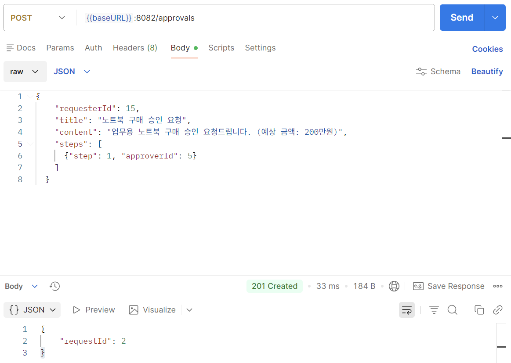

#### **9.2.2 다단계 결재 요청 (3단계)**

**시나리오**: CEO까지 승인이 필요한 3단계 결재를 생성한다.

```powershell
curl -X POST http://localhost:8082/approvals `
  -H "Content-Type: application/json" `
  -d '{
    "requesterId": 15,
    "title": "2024년 1분기 개발팀 예산 승인 요청",
    "content": "개발팀 운영 예산 1억원 승인 요청드립니다.",
    "steps": [
      {"step": 1, "approverId": 5},
      {"step": 2, "approverId": 2},
      {"step": 3, "approverId": 1}
    ]
  }'
```

**예상 결과**:
```json
{
  "requestId": 2
}
```

**검증 포인트**:
- ✅ 3개의 결재 단계 생성
- ✅ 첫 번째 결재자(5번)의 대기 목록에만 추가
- ✅ finalStatus: "in_progress"

- 다단계 결재 요청 화면
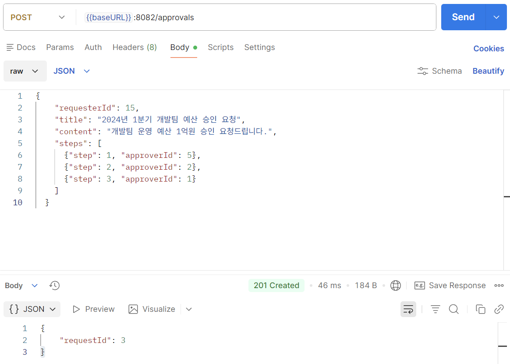

#### **9.2.3 유효성 검증 테스트**

**시나리오**: 존재하지 않는 직원 ID로 결재 요청 시 오류 처리를 확인한다.

```powershell
# 존재하지 않는 요청자
curl -X POST http://localhost:8082/approvals `
  -H "Content-Type: application/json" `
  -d '{
    "requesterId": 9999,
    "title": "테스트",
    "content": "테스트",
    "steps": [{"step": 1, "approverId": 1}]
  }'

# 존재하지 않는 결재자
curl -X POST http://localhost:8082/approvals `
  -H "Content-Type: application/json" `
  -d '{
    "requesterId": 1,
    "title": "테스트",
    "content": "테스트",
    "steps": [{"step": 1, "approverId": 9999}]
  }'
```

**예상 결과**:
- 400 Bad Request 또는 404 Not Found
- 에러 메시지: "직원이 존재하지 않습니다"

**검증 포인트**:
- ✅ Employee Service 연동 확인
- ✅ 적절한 HTTP 상태 코드
- ✅ 명확한 에러 메시지

- 직원이 존재하지 않을 시 유효성 검증 테스트 화면
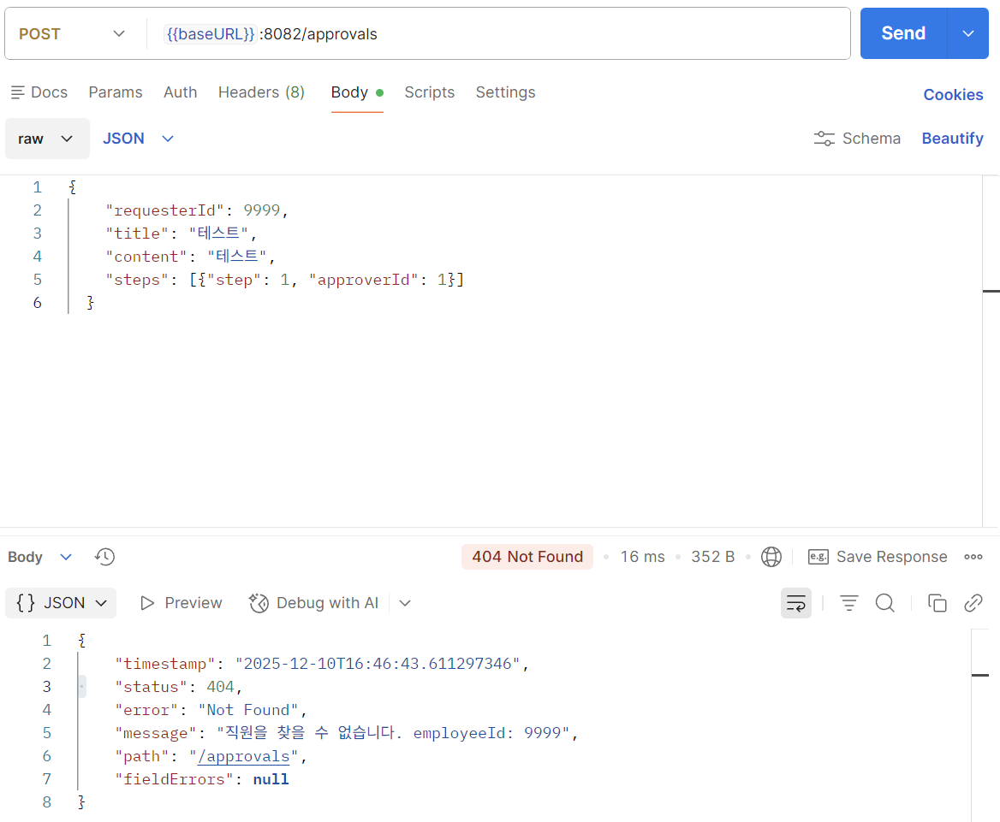

### 9.3 결재 승인 테스트

#### **9.3.1 단일 단계 승인 (최종 승인)**

**시나리오**: 1단계 결재를 승인하여 최종 승인 처리한다.

```powershell
# 1. 결재 요청 생성 (requestId: 3)
curl -X POST http://localhost:8082/approvals `
  -H "Content-Type: application/json" `
  -d '{
    "requesterId": 15,
    "title": "소프트웨어 라이센스 구매",
    "content": "IntelliJ IDEA Ultimate 라이센스 구매 승인 요청",
    "steps": [{"step": 1, "approverId": 5}]
  }'

# 2. 결재자 대기 목록 확인
curl http://localhost:8083/process/5

# 3. 결재 승인
curl -X POST http://localhost:8083/process/5/3 `
  -H "Content-Type: application/json" `
  -d '{
    "status": "approved",
    "comment": "승인합니다."
  }'

# 4. 결재 결과 확인
curl http://localhost:8082/approvals/3
```

**예상 결과**:
```json
{
  "requestId": 3,
  "finalStatus": "approved",
  "steps": [
    {
      "step": 1,
      "approverId": 5,
      "status": "approved",
      "comment": "승인합니다.",
      "updatedAt": "2024-01-01T10:30:00"
    }
  ]
}
```

**검증 포인트**:
- ✅ finalStatus: "approved"
- ✅ step 1 status: "approved"
- ✅ comment 저장 확인
- ✅ updatedAt 자동 설정
- ✅ Kafka approval-result 토픽 메시지 발행
- ✅ 대기 목록에서 제거

- 단일 단계 승인 대기 화면
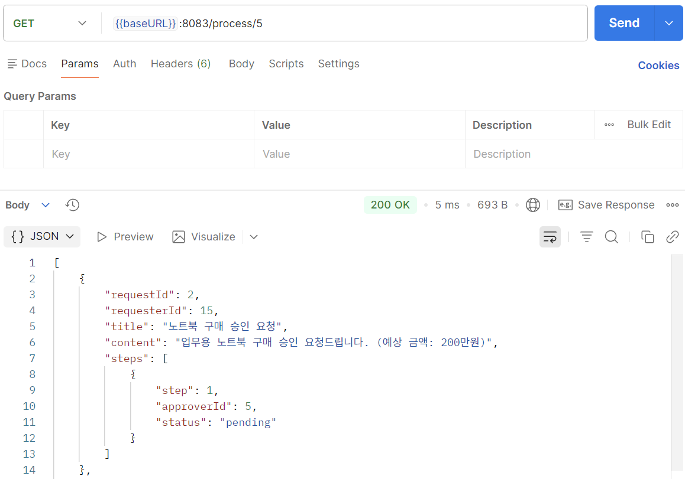

- 단일 단계 결재 처리 화면
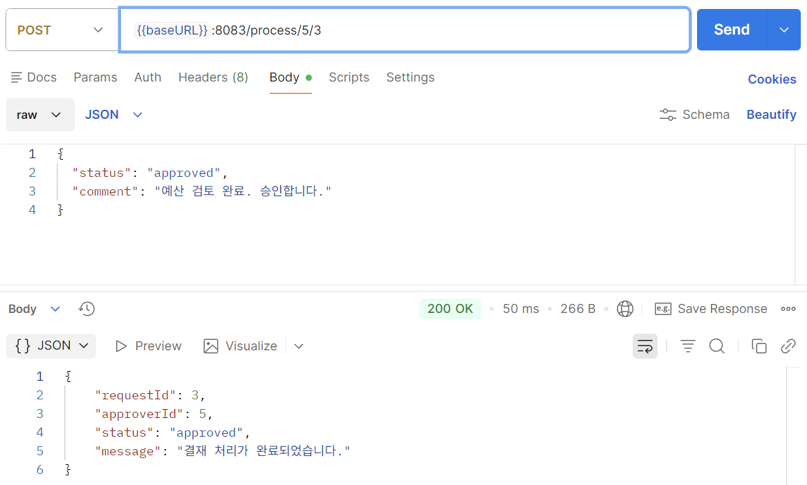

#### **9.3.2 다단계 승인 (중간 승인)**

**시나리오**: 3단계 중 1단계만 승인하여 다음 결재자에게 넘어간다.

```powershell
# 1. 3단계 결재 요청 생성 (requestId: 4)
curl -X POST http://localhost:8082/approvals `
  -H "Content-Type: application/json" `
  -d '{
    "requesterId": 20,
    "title": "클라우드 인프라 예산 승인",
    "content": "AWS 인프라 비용 5천만원 승인 요청",
    "steps": [
      {"step": 1, "approverId": 7},
      {"step": 2, "approverId": 2},
      {"step": 3, "approverId": 1}
    ]
  }'

# 2. 1단계 결재자(7번) 대기 목록 확인
curl http://localhost:8083/process/7

# 3. 1단계 승인
curl -X POST http://localhost:8083/process/7/4 `
  -H "Content-Type: application/json" `
  -d '{
    "status": "approved",
    "comment": "인프라 필요성 확인. 승인합니다."
  }'

# 4. 2단계 결재자(2번) 대기 목록 확인
curl http://localhost:8083/process/2

# 5. 결재 상태 확인
curl http://localhost:8082/approvals/4
```

**예상 결과**:
```json
{
  "requestId": 4,
  "finalStatus": "in_progress",
  "steps": [
    {
      "step": 1,
      "approverId": 7,
      "status": "approved",
      "comment": "인프라 필요성 확인. 승인합니다.",
      "updatedAt": "2024-01-01T10:00:00"
    },
    {
      "step": 2,
      "approverId": 2,
      "status": "pending",
      "comment": null,
      "updatedAt": null
    },
    {
      "step": 3,
      "approverId": 1,
      "status": "pending",
      "comment": null,
      "updatedAt": null
    }
  ]
}
```

**검증 포인트**:
- ✅ finalStatus: "in_progress" (아직 진행 중)
- ✅ step 1: "approved", step 2-3: "pending"
- ✅ 결재자 7번 대기 목록에서 제거
- ✅ 결재자 2번 대기 목록에 유지

- 다단계 승인 결재 생성
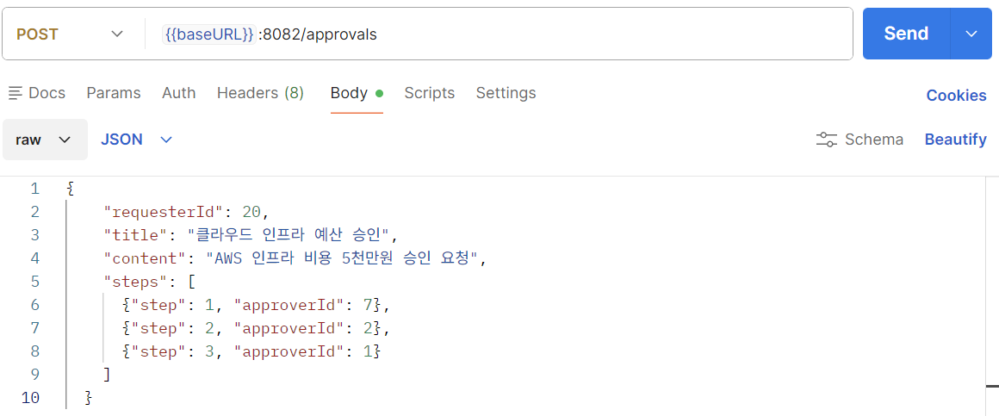

- 7번 id 직원의 4번 결재 승인


- 4번 결재의 경과 확인
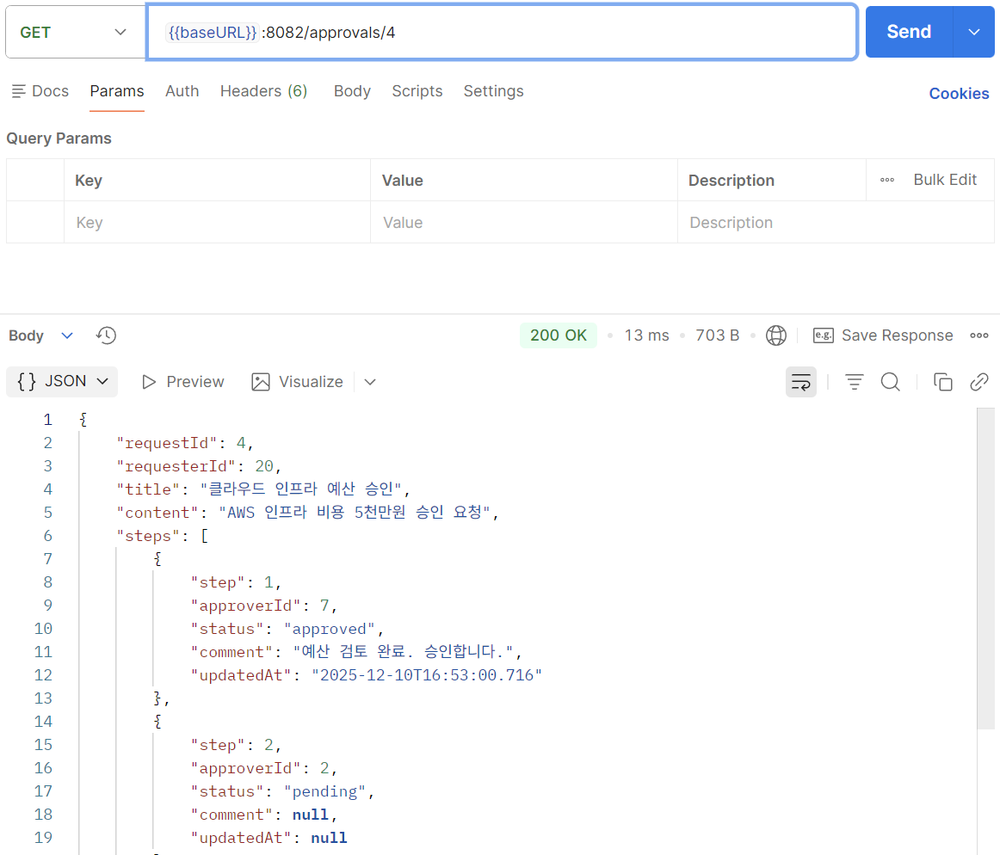

#### **9.3.3 전체 단계 순차 승인**

**시나리오**: 3단계를 모두 순차적으로 승인하여 최종 승인까지 완료한다.

```powershell
# 1. 2단계 승인
curl -X POST http://localhost:8083/process/2/4 `
  -H "Content-Type: application/json" `
  -d '{
    "status": "approved",
    "comment": "기술본부 검토 완료. 승인합니다."
  }'

# 2. 상태 확인 (아직 in_progress)
curl http://localhost:8082/approvals/4

# 3. 3단계 승인 (CEO 최종 승인)
curl -X POST http://localhost:8083/process/1/4 `
  -H "Content-Type: application/json" `
  -d '{
    "status": "approved",
    "comment": "최종 승인합니다."
  }'

# 4. 최종 상태 확인
curl http://localhost:8082/approvals/4
```

**예상 결과**:
```json
{
  "requestId": 4,
  "finalStatus": "approved",
  "steps": [
    {
      "step": 1,
      "approverId": 7,
      "status": "approved",
      "comment": "인프라 필요성 확인. 승인합니다.",
      "updatedAt": "2024-01-01T10:00:00"
    },
    {
      "step": 2,
      "approverId": 2,
      "status": "approved",
      "comment": "기술본부 검토 완료. 승인합니다.",
      "updatedAt": "2024-01-01T14:00:00"
    },
    {
      "step": 3,
      "approverId": 1,
      "status": "approved",
      "comment": "최종 승인합니다.",
      "updatedAt": "2024-01-01T16:00:00"
    }
  ]
}
```

**검증 포인트**:
- ✅ finalStatus: "approved" (최종 승인)
- ✅ 모든 step status: "approved"
- ✅ 각 단계별 comment와 updatedAt 저장
- ✅ 모든 결재자 대기 목록에서 제거

- 현재 모든 승인이 완료되어 approved 된 상태
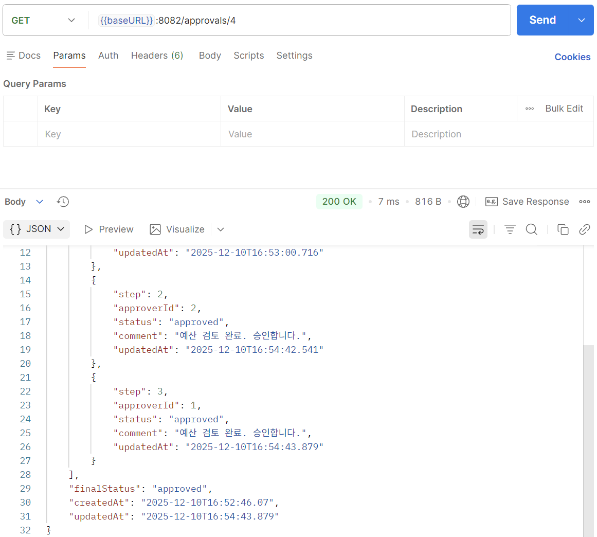

### 9.4 결재 반려 테스트

#### **9.4.1 첫 번째 단계에서 반려**

**시나리오**: 첫 번째 결재자가 즉시 반려한다.

```powershell
# 1. 결재 요청 생성 (requestId: 5)
curl -X POST http://localhost:8082/approvals `
  -H "Content-Type: application/json" `
  -d '{
    "requesterId": 15,
    "title": "해외 출장 승인 요청",
    "content": "실리콘밸리 컨퍼런스 참가",
    "steps": [
      {"step": 1, "approverId": 5},
      {"step": 2, "approverId": 2}
    ]
  }'

# 2. 1단계 반려
curl -X POST http://localhost:8083/process/5/5 `
  -H "Content-Type: application/json" `
  -d '{
    "status": "rejected",
    "comment": "예산 부족으로 반려합니다."
  }'

# 3. 결재 상태 확인
curl http://localhost:8082/approvals/5
```

**예상 결과**:
```json
{
  "requestId": 5,
  "finalStatus": "rejected",
  "steps": [
    {
      "step": 1,
      "approverId": 5,
      "status": "rejected",
      "comment": "예산 부족으로 반려합니다.",
      "updatedAt": "2024-01-01T10:00:00"
    },
    {
      "step": 2,
      "approverId": 2,
      "status": "pending",
      "comment": null,
      "updatedAt": null
    }
  ]
}
```

**검증 포인트**:
- ✅ finalStatus: "rejected" (즉시 최종 반려)
- ✅ step 1: "rejected"
- ✅ step 2: "pending" (더 이상 진행 안 됨)
- ✅ 모든 결재자 대기 목록에서 제거
- ✅ 반려 사유(comment) 저장

- 결재자가 결재 반려함
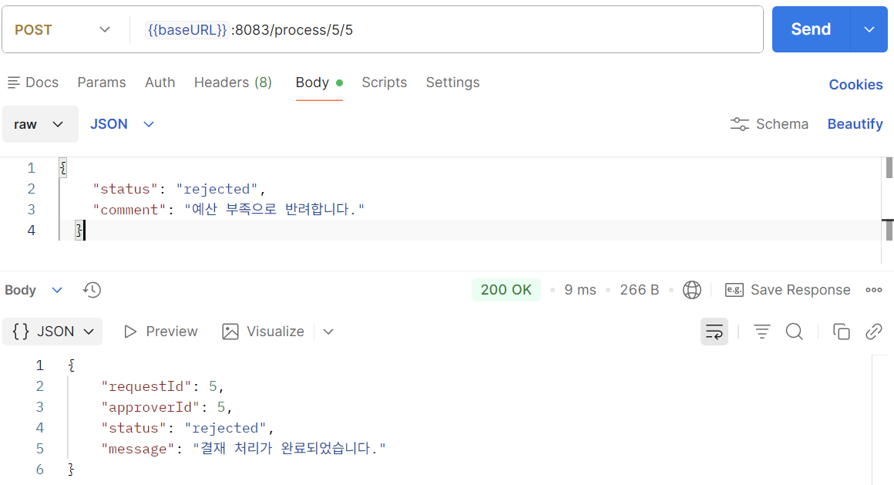

- rejected된 3번 결재
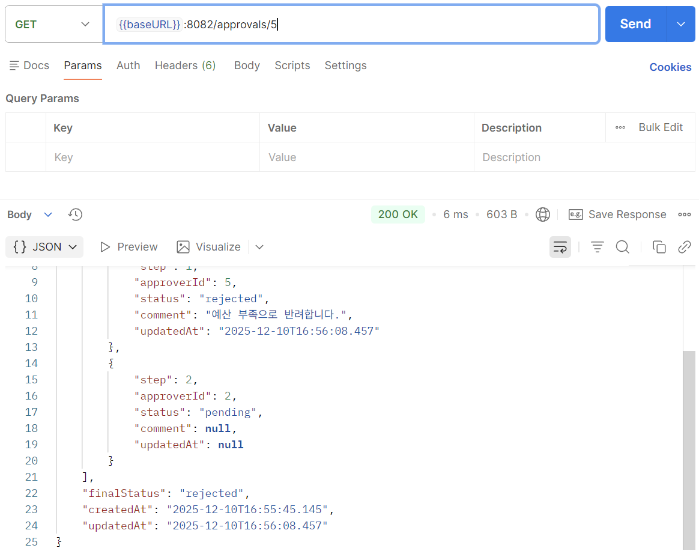

#### **9.4.2 중간 단계에서 반려**

**시나리오**: 2단계에서 반려되어 3단계로 넘어가지 않는다.

```powershell
# 1. 3단계 결재 요청 생성 (requestId: 6)
curl -X POST http://localhost:8082/approvals `
  -H "Content-Type: application/json" `
  -d '{
    "requesterId": 20,
    "title": "신규 인력 채용 승인",
    "content": "백엔드 개발자 5명 채용 승인 요청",
    "steps": [
      {"step": 1, "approverId": 5},
      {"step": 2, "approverId": 2},
      {"step": 3, "approverId": 1}
    ]
  }'

# 2. 1단계 승인
curl -X POST http://localhost:8083/process/5/6 `
  -H "Content-Type: application/json" `
  -d '{
    "status": "approved",
    "comment": "팀 증원 필요성 동의. 승인합니다."
  }'

# 3. 2단계 반려
curl -X POST http://localhost:8083/process/2/6 `
  -H "Content-Type: application/json" `
  -d '{
    "status": "rejected",
    "comment": "현재 예산으로는 3명까지만 가능합니다."
  }'

# 4. 결재 상태 확인
curl http://localhost:8082/approvals/6

# 5. CEO(1번) 대기 목록 확인 (없어야 함)
curl http://localhost:8083/process/1
```

**예상 결과**:
```json
{
  "requestId": 6,
  "finalStatus": "rejected",
  "steps": [
    {
      "step": 1,
      "approverId": 5,
      "status": "approved",
      "comment": "팀 증원 필요성 동의. 승인합니다.",
      "updatedAt": "2024-01-01T10:00:00"
    },
    {
      "step": 2,
      "approverId": 2,
      "status": "rejected",
      "comment": "현재 예산으로는 3명까지만 가능합니다.",
      "updatedAt": "2024-01-01T14:00:00"
    },
    {
      "step": 3,
      "approverId": 1,
      "status": "pending",
      "comment": null,
      "updatedAt": null
    }
  ]
}
```

**검증 포인트**:
- ✅ finalStatus: "rejected"
- ✅ step 1: "approved", step 2: "rejected", step 3: "pending"
- ✅ CEO 대기 목록에 추가되지 않음
- ✅ 반려 즉시 전체 프로세스 종료

- 중간 단계가 반려되어 결재가 더이상 이루어지지 않고 rejected됨
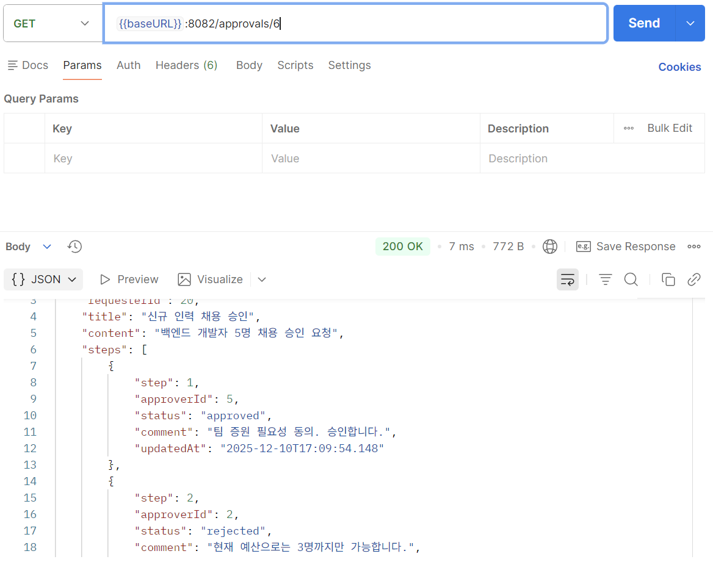

### 9.5 동시성 테스트

#### **9.5.1 동일 결재자의 동시 처리**

**시나리오**: 같은 결재자에게 여러 결재 요청이 동시에 할당되어 있을 때 처리한다.

```powershell
# 1. 5개의 결재 요청 생성 (모두 결재자 5번)
for ($i=1; $i -le 5; $i++) {
  $body = @{
    requesterId = 15
    title = "테스트 결재 $i"
    content = "동시성 테스트용 결재 요청 $i"
    steps = @(
      @{
        step = 1
        approverId = 5
      }
    )
  } | ConvertTo-Json -Depth 3

  Invoke-RestMethod -Uri http://localhost:8082/approvals `
    -Method Post `
    -ContentType "application/json" `
    -Body $body
}

# 2. 결재자 5번의 대기 목록 확인 (5개 있어야 함)
curl http://localhost:8083/process/5

# 3. 동시에 3개 승인 (병렬 실행)
$jobs = @()
$jobs += Start-Job -ScriptBlock {
  Invoke-RestMethod -Uri http://localhost:8083/process/5/7 `
    -Method Post `
    -ContentType "application/json" `
    -Body '{"status": "approved", "comment": "승인1"}'
}
$jobs += Start-Job -ScriptBlock {
  Invoke-RestMethod -Uri http://localhost:8083/process/5/8 `
    -Method Post `
    -ContentType "application/json" `
    -Body '{"status": "approved", "comment": "승인2"}'
}
$jobs += Start-Job -ScriptBlock {
  Invoke-RestMethod -Uri http://localhost:8083/process/5/9 `
    -Method Post `
    -ContentType "application/json" `
    -Body '{"status": "rejected", "comment": "반려1"}'
}
$jobs | Wait-Job | Receive-Job
$jobs | Remove-Job

# 4. 결과 확인
curl http://localhost:8082/approvals/7
curl http://localhost:8082/approvals/8
curl http://localhost:8082/approvals/9

# 5. 대기 목록 확인 (2개 남아있어야 함)
curl http://localhost:8083/process/5
```

**검증 포인트**:
- ✅ ConcurrentHashMap의 스레드 안전성
- ✅ 각 결재가 독립적으로 처리됨
- ✅ 데이터 일관성 유지
- ✅ 동시 요청 시 응답 시간 측정

- powershell을 이용해 병렬 처리 생성
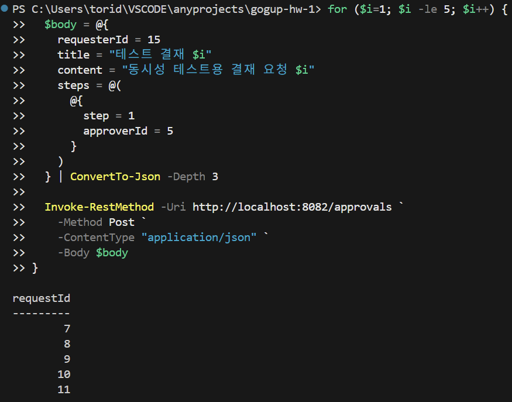

- 동시에 3개 승인과, 승인된 3개의 결재


- 아직 처리되지 않은 2개의 결재, 즉 정상 작동
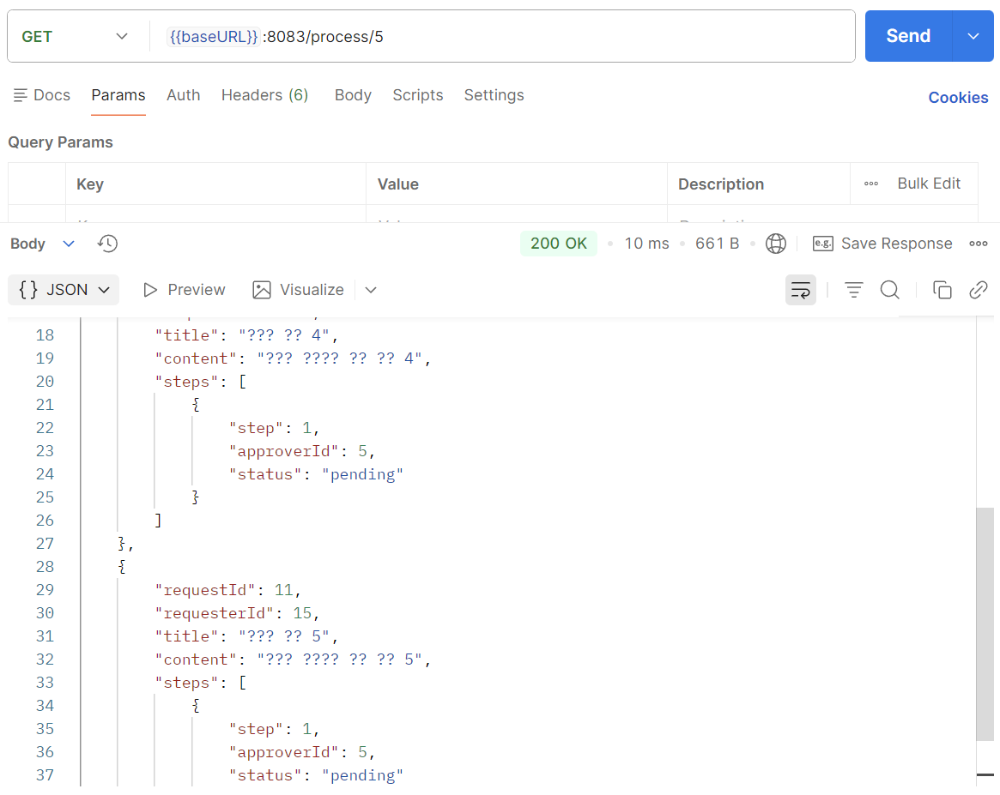

#### **9.5.2 Kafka 메시지 순서 보장**

**시나리오**: 여러 결재 요청이 빠르게 생성될 때 Kafka 메시지 순서를 확인한다.

```powershell
# 1. 10개의 결재 요청을 빠르게 생성
for ($i=1; $i -le 10; $i++) {
  $body = @{
    requesterId = 15
    title = "순서 테스트 $i"
    content = "Kafka 메시지 순서 테스트"
    steps = @(@{step = 1; approverId = 5})
  } | ConvertTo-Json -Depth 3

  Invoke-RestMethod -Uri http://localhost:8082/approvals `
    -Method Post `
    -ContentType "application/json" `
    -Body $body
}

# 2. Kafka 메시지 확인
docker exec -it erp-kafka kafka-console-consumer `
  --bootstrap-server localhost:9092 `
  --topic approval-request `
  --from-beginning
```

**검증 포인트**:
- ✅ Kafka 메시지 순서 확인
  - 다만, 현재 Kafka의 파티션은 3개로 파티션에 분산되어 저장되어 메시지의 순서는 보장되지 않는다.
- ✅ 모든 메시지가 Processing Service에 도달
- ✅ In-Memory 저장소에 모두 추가됨

- 결재 10개를 순차 생성하고 잘 생성되었는지 확인
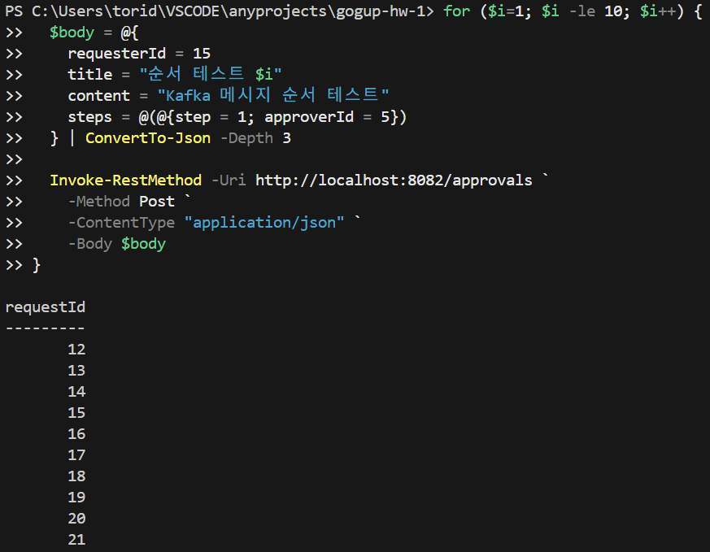

- kafka에 모든 메시지가 잘 반영되었는지 확인
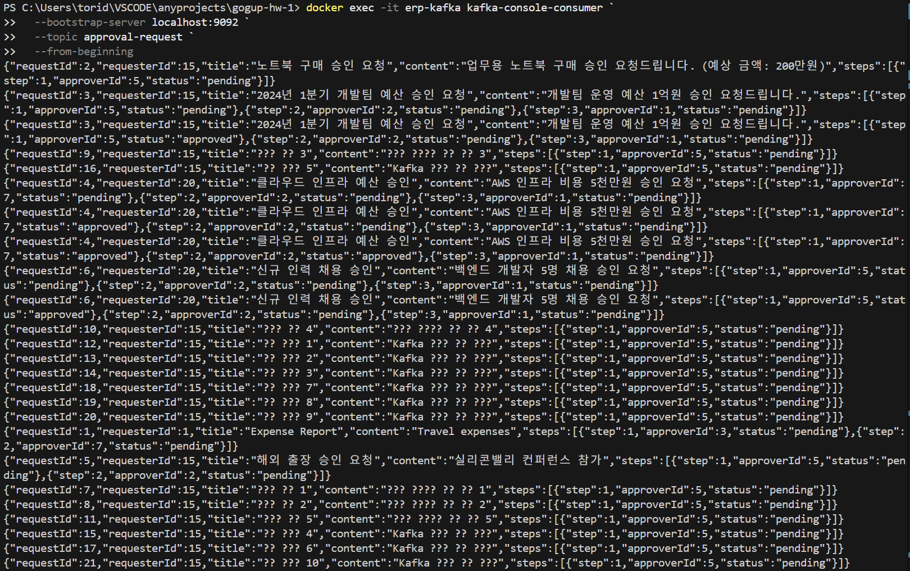

### 9.6 WebSocket 실시간 알림 테스트

#### **9.6.1 WebSocket 연결 테스트**

**시나리오**: JavaScript 클라이언트로 WebSocket 연결 후 알림을 수신한다.

**테스트 절차**:
1. 브라우저에서 <localhost:8084> 열기
2. 직원 ID 15 입력 후 연결
3. 다른 터미널에서 결재 요청 생성 및 승인
4. 브라우저에서 실시간 알림 확인

```powershell
# 결재 요청 생성
curl -X POST http://localhost:8082/approvals `
  -H "Content-Type: application/json" `
  -d '{
    "requesterId": 15,
    "title": "WebSocket 테스트",
    "content": "실시간 알림 테스트",
    "steps": [{"step": 1, "approverId": 5}]
  }'

# 결재 승인 (브라우저에서 알림 확인)
curl -X POST http://localhost:8083/process/5/[requestId] `
  -H "Content-Type: application/json" `
  -d '{
    "status": "approved",
    "comment": "승인합니다."
  }'
```

**검증 포인트**:
- ✅ 연결 즉시 CONNECTED 메시지 수신
- ✅ 결재 승인 시 APPROVAL_RESULT 메시지 수신
- ✅ 메시지 JSON 형식 정확성
- ✅ finalResult 값 확인 (approved/rejected/in_progress)

- 결재가 승인되었을때 브라우저 창
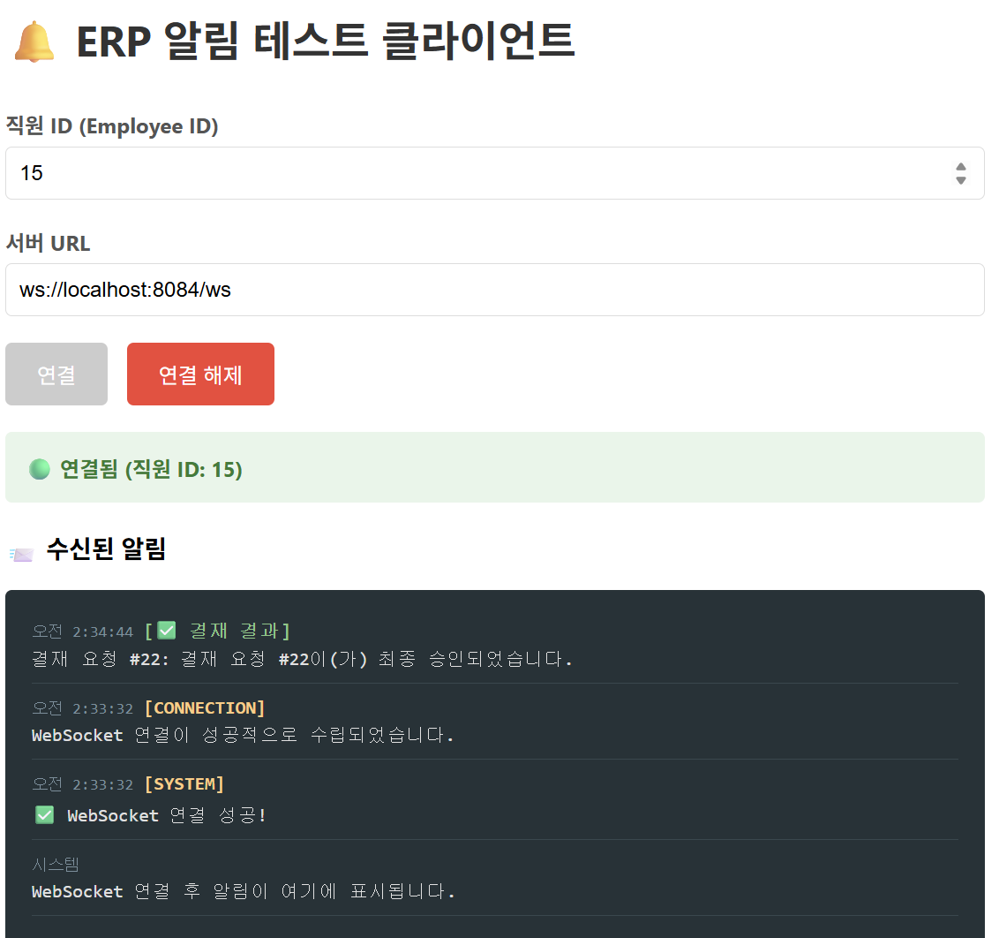
- **만약 결재 Step이 남아있을 경우**
만약 결제 했지만 남은 Step이 존재한다면 그림과 같이 결과가 생긴다


#### **9.6.2 다중 클라이언트 테스트**

**시나리오**: 여러 직원이 동시에 WebSocket 연결 후 각자의 알림만 수신한다.

```powershell
# 1. 브라우저 2개로 각각 직원 ID 15, 20, 25로 연결

# 2. 직원 15의 결재 요청 생성 및 승인
curl -X POST http://localhost:8082/approvals `
  -H "Content-Type: application/json" `
  -d '{
    "requesterId": 15,
    "title": "직원 15 테스트",
    "content": "테스트",
    "steps": [{"step": 1, "approverId": 5}]
  }'

curl -X POST http://localhost:8083/process/5/[requestId] `
  -H "Content-Type: application/json" `
  -d '{"status": "approved", "comment": "승인"}'

# 3. 직원 20의 결재 요청 생성 및 승인
curl -X POST http://localhost:8082/approvals `
  -H "Content-Type: application/json" `
  -d '{
    "requesterId": 20,
    "title": "직원 20 테스트",
    "content": "테스트",
    "steps": [{"step": 1, "approverId": 5}]
  }'

curl -X POST http://localhost:8083/process/5/[requestId] `
  -H "Content-Type: application/json" `
  -d '{"status": "approved", "comment": "승인"}'
```

**검증 포인트**:
- ✅ 직원 15는 자신의 알림만 수신
- ✅ 직원 20은 자신의 알림만 수신
- ✅ 직원 25는 알림 수신 안 함
- ✅ 세션 격리 확인

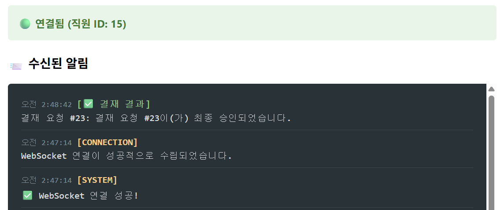

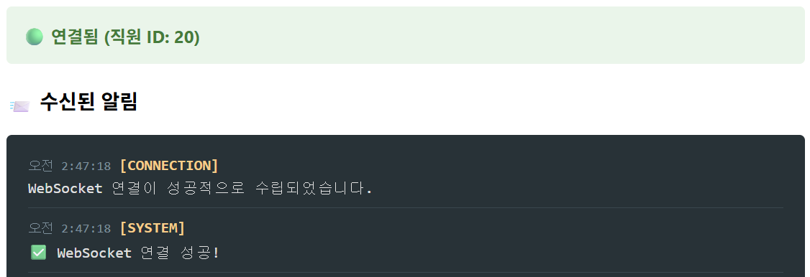

### 9.7 통계 기능 테스트

#### **9.7.1 전체 통계 조회**

**시나리오**: 여러 결재를 생성하고 승인/반려 후 통계를 확인한다.

```powershell
# 1. 10개의 결재 생성 및 처리 (7개 승인, 3개 반려)
# ... (앞선 테스트에서 생성한 데이터 활용)

# 2. 전체 통계 조회
curl http://localhost:8082/statistics
```

**예상 결과**:
```json
{
  "totalRequests": 10,
  "approvedCount": 7,
  "rejectedCount": 3,
  "inProgressCount": 0,
  "approvalRate": 70.0,
  "rejectionRate": 30.0,
  "avgStepsCount": 2.3,
  "requestsByEmployee": {
    "15": 6,
    "20": 4
  }
}
```

**검증 포인트**:
- ✅ 총 결재 수 정확성
- ✅ 승인/반려 비율 계산
- ✅ 평균 결재 단계 수 계산
- ✅ 요청자별 집계

- 통계 화면
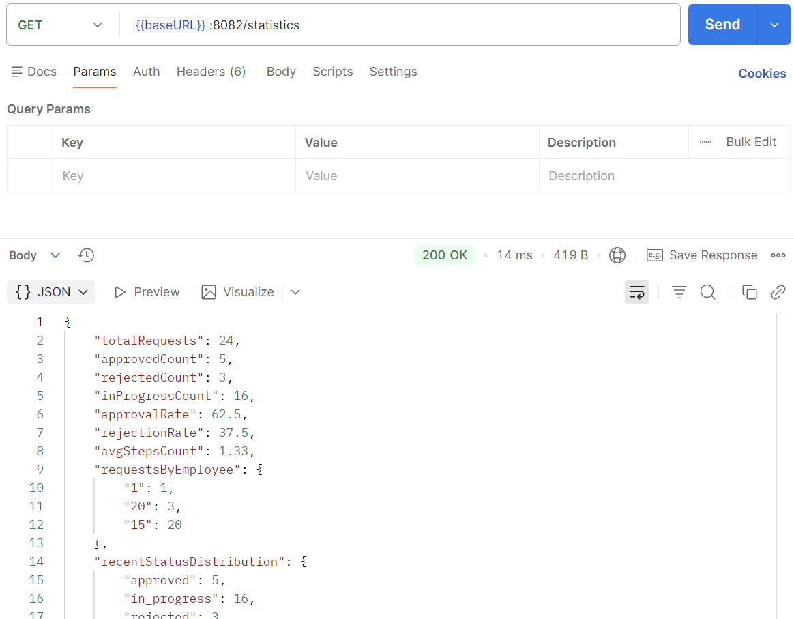

#### **9.7.2 요청자별 통계 조회**

**시나리오**: 특정 직원의 결재 통계만 조회한다.

```powershell
# 직원 15번의 통계
curl http://localhost:8082/statistics/requester/15

# 직원 20번의 통계
curl http://localhost:8082/statistics/requester/20
```

**예상 결과**:
```json
{
  "totalRequests": 6,
  "approvedCount": 4,
  "rejectedCount": 2,
  "approvalRate": 66.67
}
```

**검증 포인트**:
- ✅ 해당 요청자 데이터만 집계
- ✅ 비율 계산 정확성

- 15번 직원의 통계
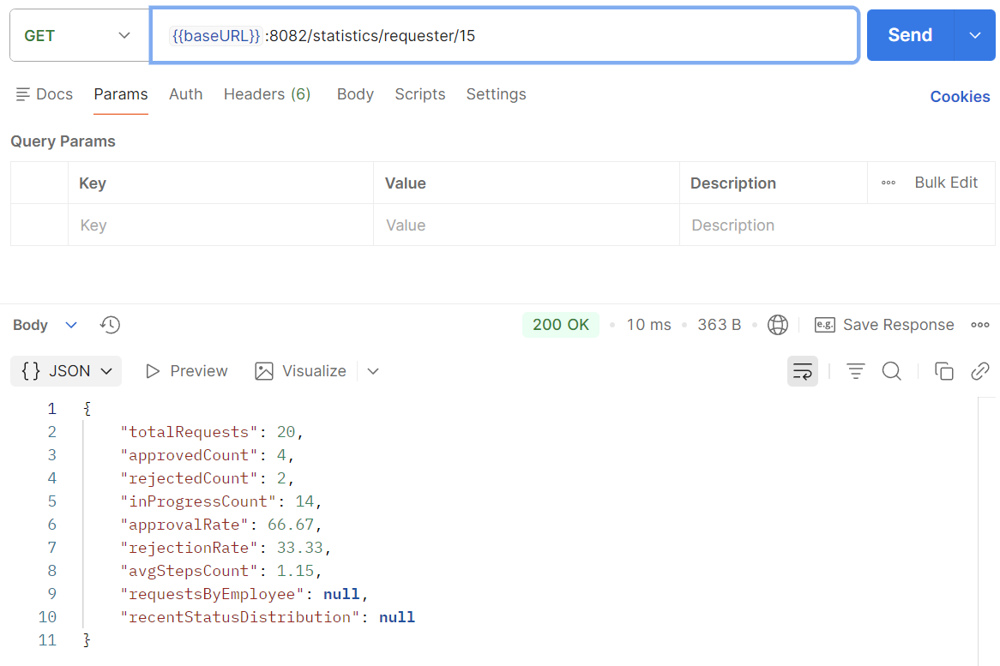

### 9.8 에러 처리 및 복구 테스트

#### **9.8.1 서비스 장애 시나리오**

**시나리오**: Employee Service가 다운된 상태에서 결재 요청 시 에러 처리를 확인한다.

```powershell
# 1. Employee Service 중지
docker compose stop employee-service

# 2. 결재 요청 생성 시도
curl -X POST http://localhost:8082/approvals `
  -H "Content-Type: application/json" `
  -d '{
    "requesterId": 15,
    "title": "테스트",
    "content": "테스트",
    "steps": [{"step": 1, "approverId": 5}]
  }'

# 3. Employee Service 재시작
docker compose start employee-service

# 4. 재시도
curl -X POST http://localhost:8082/approvals `
  -H "Content-Type: application/json" `
  -d '{
    "requesterId": 15,
    "title": "테스트",
    "content": "테스트",
    "steps": [{"step": 1, "approverId": 5}]
  }'
```

**검증 포인트**:
- ✅ 적절한 에러 응답 
- ✅ 서비스 복구 후 정상 동작
- ✅ 로그에 에러 기록

**검증 결과**
- ⚠️ 404 에러로, 예상과는 다른 결과
- ✅ 로그에는 기록이 됨
- 🔧 추후 개선 필요

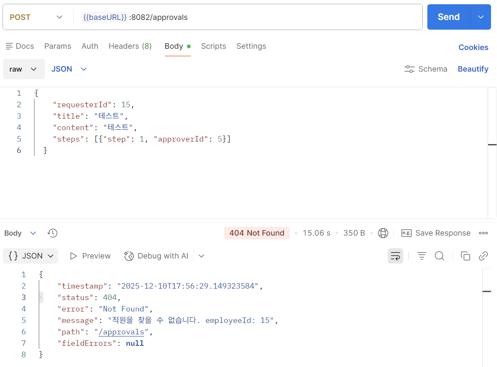

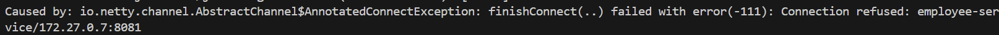

#### **9.8.2 Kafka 장애 복구**

**시나리오**: Kafka가 다운된 상태에서 메시지 발행 실패를 확인한다.

```powershell
# 1. Kafka 중지
docker compose stop kafka

# 2. 결재 요청 생성 시도 (실패 예상)
curl -X POST http://localhost:8082/approvals `
  -H "Content-Type: application/json" `
  -d '{
    "requesterId": 15,
    "title": "Kafka 장애 테스트",
    "content": "테스트",
    "steps": [{"step": 1, "approverId": 5}]
  }'

# 3. Kafka 재시작
docker compose start kafka

# 4. 재시도
curl -X POST http://localhost:8082/approvals `
  -H "Content-Type: application/json" `
  -d '{
    "requesterId": 15,
    "title": "Kafka 복구 후 테스트",
    "content": "테스트",
    "steps": [{"step": 1, "approverId": 5}]
  }'
```

**검증 포인트**:
- ✅ Kafka 다운 시 에러 처리
- ✅ Kafka 복구 후 정상 동작
- ✅ 메시지 유실 없음

**검증 결과**
- ❌ Kafka가 stop되었음에도 메시지는 오류 없이 200을 반환하며 저장
- 🚨 즉시 개선 필요한 항목으로 지정

### 9.9 성능 테스트

#### **9.9.1 대량 결재 요청 처리**

**시나리오**: 100개의 결재 요청을 빠르게 생성한다.

```powershell
# 100개의 결재 요청 생성
for ($i=1; $i -le 100; $i++) {
  $body = @{
    requesterId = 15
    title = "성능 테스트 $i"
    content = "대량 요청 테스트"
    steps = @(
      @{step = 1; approverId = 5},
      @{step = 2; approverId = 2}
    )
  } | ConvertTo-Json -Depth 3
  
  Invoke-RestMethod -Uri "http://localhost:8082/approvals" `
    -Method Post `
    -ContentType "application/json" `
    -Body $body
}

# 처리 시간 측정
Measure-Command {
  for ($i=1; $i -le 100; $i++) {
    $body = @{
      requesterId = 15
      title = "성능 테스트 $i"
      content = "대량 요청 테스트"
      steps = @(
        @{step = 1; approverId = 5},
        @{step = 2; approverId = 2}
      )
    } | ConvertTo-Json -Depth 3
    
    Invoke-RestMethod -Uri "http://localhost:8082/approvals" `
      -Method Post `
      -ContentType "application/json" `
      -Body $body
  }
}
```

**검증 포인트**:
- ✅ 평균 응답 시간 측정
- ✅ MongoDB 삽입 성능
- ✅ Kafka 처리량
- ✅ In-Memory 저장소 성능

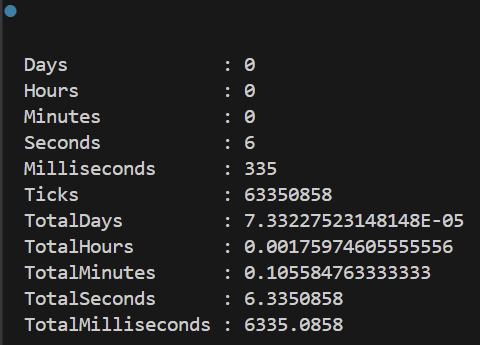

#### **9.9.2 조회 성능 테스트**

**시나리오**: 대량 데이터가 있을 때 조회 성능을 측정한다.

```powershell
# 전체 결재 목록 조회 성능
Measure-Command {
  curl http://localhost:8082/approvals
}

# 특정 결재 조회 성능
Measure-Command {
  curl http://localhost:8082/approvals/50
}

# 통계 조회 성능
Measure-Command {
  curl http://localhost:8082/statistics
}
```

**검증 포인트**:
- ✅ 조회 응답 시간 (< 1초 권장)
- ✅ MongoDB 인덱스 효과
- ✅ 페이징 필요성 검토

- 특정 결재 조회 성능 예시 
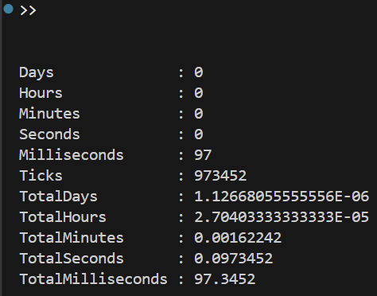

### 9.10 종합 시나리오

#### **9.10.1 실제 업무 시나리오**

**시나리오**: 신입 사원이 노트북 구매 요청 → 팀장 승인 → CTO 승인 → CEO 최종 승인

```powershell
# 1. 신입 사원(25번)이 노트북 구매 요청
curl -X POST http://localhost:8082/approvals `
  -H "Content-Type: application/json" `
  -d '{
    "requesterId": 25,
    "title": "업무용 노트북 구매 승인 요청",
    "content": "MacBook Pro 16인치 구매 승인 요청드립니다. (300만원)",
    "steps": [
      {"step": 1, "approverId": 5},
      {"step": 2, "approverId": 2},
      {"step": 3, "approverId": 1}
    ]
  }'

# 2. 팀장(5번) 대기 목록 확인 및 승인
curl http://localhost:8083/process/5
curl -X POST http://localhost:8083/process/5/[requestId] `
  -H "Content-Type: application/json" `
  -d '{
    "status": "approved",
    "comment": "신입 사원 업무용으로 필요합니다. 승인합니다."
  }'

# 3. CTO(2번) 대기 목록 확인 및 승인
curl http://localhost:8083/process/2
curl -X POST http://localhost:8083/process/2/[requestId] `
  -H "Content-Type: application/json" `
  -d '{
    "status": "approved",
    "comment": "기술본부 예산 범위 내. 승인합니다."
  }'

# 4. CEO(1번) 대기 목록 확인 및 최종 승인
curl http://localhost:8083/process/1
curl -X POST http://localhost:8083/process/1/[requestId] `
  -H "Content-Type: application/json" `
  -d '{
    "status": "approved",
    "comment": "최종 승인합니다."
  }'

# 5. 신입 사원(25번)의 WebSocket으로 최종 승인 알림 수신 확인

# 6. 최종 결과 확인
curl http://localhost:8082/approvals/[requestId]
```

**예상 전체 흐름**:
1. 요청 생성 → MongoDB 저장 → Kafka 발행
2. 팀장 대기 목록에 추가 → 팀장 승인 → Kafka 발행
3. CTO 대기 목록에 추가 → CTO 승인 → Kafka 발행
4. CEO 대기 목록에 추가 → CEO 최종 승인 → Kafka 발행
5. MongoDB 최종 상태 업데이트 → 신입 사원에게 WebSocket 알림

**검증 포인트**:
- ✅ 전체 프로세스 정상 동작
- ✅ 각 단계별 알림 전송
- ✅ 데이터 일관성 유지
- ✅ 모든 서비스 연동 확인

1. 결재 요청 생성
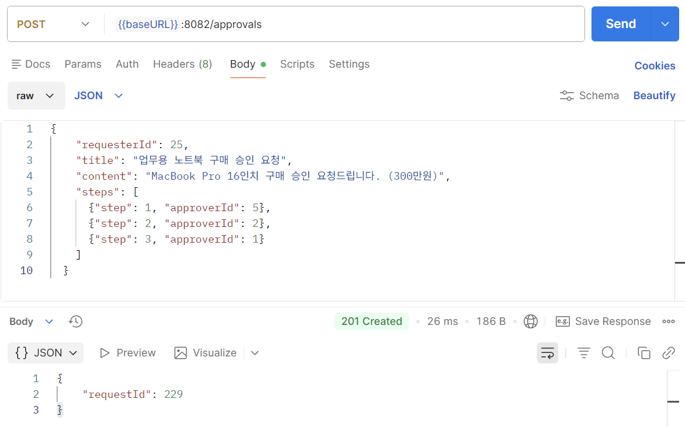

2. 팀장 승인


3. CTO 승인


4. CEO 승인
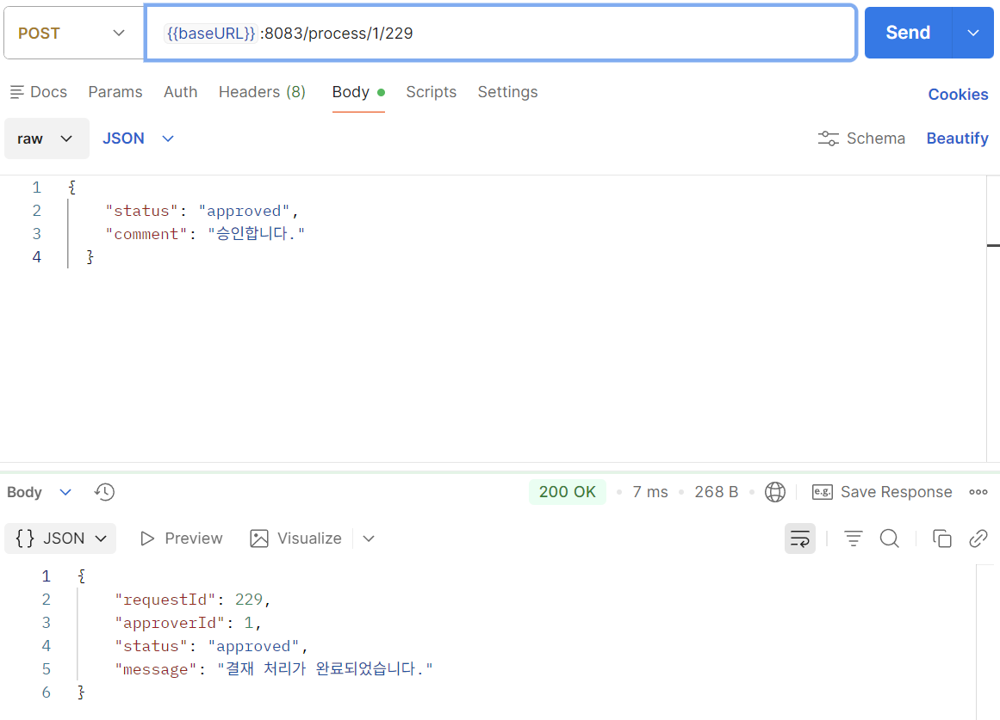

5. 요청자의 브라우저 알림
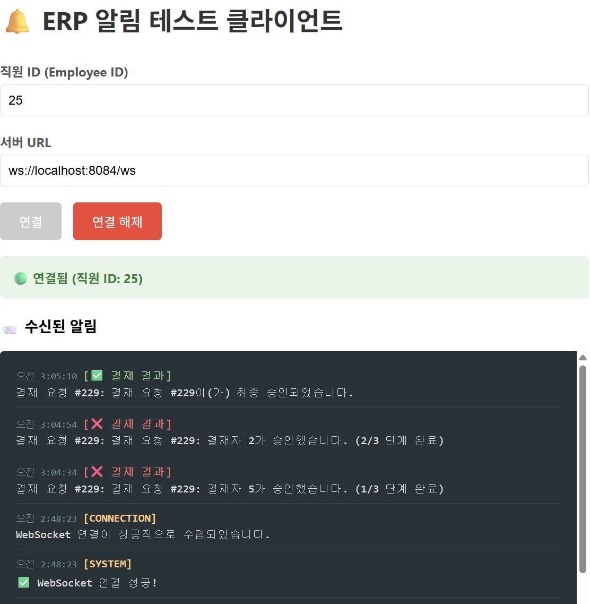

6. 최종 결과
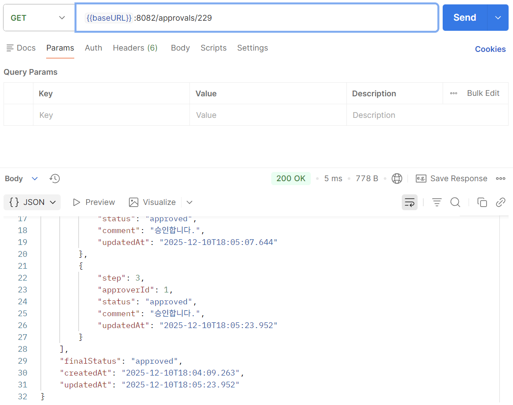

---

## 10. 실행 화면 스크린샷
- "8.2 Docker Compose를 이용한 실행 (권장)"에 포함되어 있음
- "9. 테스트 시나리오"에 포함되어있음

---

## 11. 개발 중 문제와 해결 방법

### 11.1 MySQL 한글 인코딩 문제

**문제**: MySQL 테이블에 한글 데이터 삽입 시 깨짐 현상 발생

**원인**: 
- 데이터베이스 기본 캐릭터셋이 `latin1`로 설정되어 있음
- 테이블 생성 시 UTF-8 인코딩 미지정

**해결 방법**:
1. **데이터베이스 레벨에서 UTF-8 설정**
```sql
CREATE DATABASE erp_employee 
CHARACTER SET utf8mb4 
COLLATE utf8mb4_unicode_ci;
```

2. **테이블 생성 시 명시적으로 인코딩 지정**
```sql
CREATE TABLE employees (
    id BIGINT PRIMARY KEY AUTO_INCREMENT,
    name VARCHAR(100) NOT NULL,
    department VARCHAR(100) NOT NULL,
    position VARCHAR(100) NOT NULL,
    -- ... 기타 컬럼 ...
) CHARACTER SET utf8mb4 COLLATE utf8mb4_unicode_ci;
```

3. **Docker Compose에서 MySQL 환경변수 설정**
```yaml
mysql:
  image: mysql:8.0
  environment:
    MYSQL_ROOT_PASSWORD: rootpassword
    MYSQL_DATABASE: erp_employee
    MYSQL_USER: erp_user
    MYSQL_PASSWORD: erp_password
  command:
    - --character-set-server=utf8mb4
    - --collation-server=utf8mb4_unicode_ci
```

**결과**: 한글 데이터 정상적으로 저장 및 조회 가능

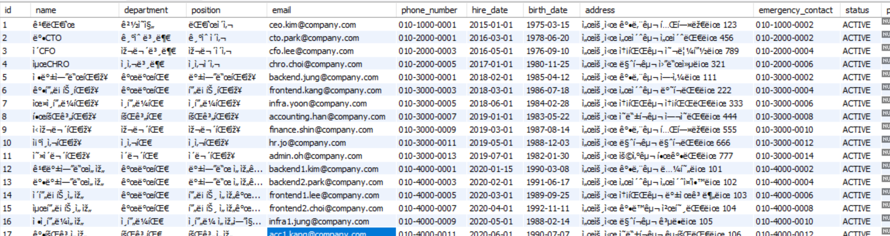

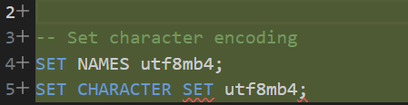

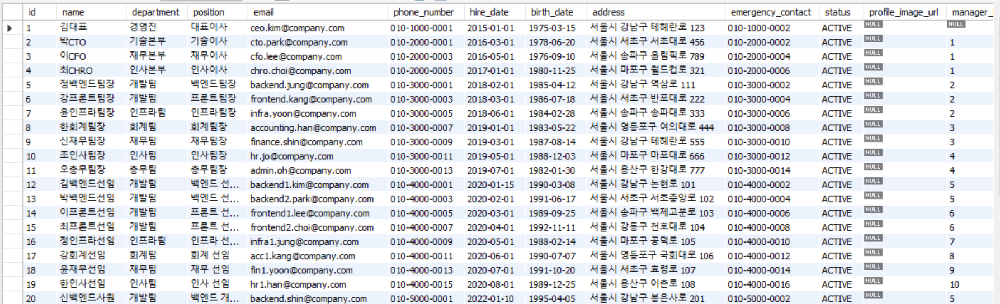

---

### 11.2 gRPC 구현 시 서버 다운 상황의 데이터 동기화 문제

**문제**: 
- gRPC를 사용하여 Approval Request Service와 Approval Processing Service 간 통신 구현
- 한 쪽 서버가 다운된 상태에서 다른 서버가 먼저 시작되면 양 서비스 간 데이터가 동기화되지 않음
- 예를 들어, Request Service에 저장된 진행 중인 결재가 Processing Service의 대기 목록에 반영되지 않는 문제 발생

**발생 시나리오**:
1. Processing Service가 다운된 상태에서 새로운 결재 요청이 Request Service에 저장됨
2. Processing Service가 재시작되더라도 다운 기간 동안 생성된 결재 요청을 알 수 없음
3. 결재자의 대기 목록에 누락된 결재가 발생하여 데이터 불일치 문제 발생

**해결 방법**: **gRPC 연결 초기화 시 자동 데이터 동기화**

- gRPC 클라이언트 설정에서 서버 간 **최초 연결 수립 시 자동으로 데이터를 동기화**하도록 로직 구현
- Processing Service가 시작될 때 Request Service에 연결하면서 모든 진행 중인 결재 요청 데이터를 가져옴
- 가져온 데이터를 기반으로 In-Memory 대기 목록을 재구성하여 서비스 재시작 전 상태로 복원
- 양방향 통신이므로 어느 쪽이 먼저 시작되더라도 연결 시점에 데이터 동기화가 자동으로 수행됨

**해결 결과**:
- ✅ 서버 재시작 후에도 데이터 일관성 보장
- ✅ 수동 개입 없이 자동으로 동기화 수행
- ✅ 다운 기간 동안 발생한 데이터 누락 방지

---

### 11.3 VS Code Spring Extension의 컴파일 옵션 문제

**문제**: 
- Spring Boot Controller에서 `@RequestParam`의 파라미터 이름이 런타임에 인식되지 않음
- Gradle 빌드 옵션에 `-parameters` 플래그를 추가해도 해결되지 않음

**원인**:
- VS Code의 Spring Boot Extension이 자체 빌드 프로세스 사용
- Gradle 설정이 Extension의 빌드 과정에 반영되지 않음

**시도한 해결 방법**:
```gradle
// build.gradle
tasks.withType(JavaCompile) {
    options.compilerArgs << '-parameters'
}
```
→ **VS Code Extension에서는 적용되지 않음**

**최종 해결**: **명시적 파라미터 이름 지정**

```java
// 문제 발생 코드
@GetMapping("/employees")
public List<EmployeeResponse> getEmployees(
    String department,  // 파라미터 이름 인식 안 됨
    String position
) { ... }

// 해결된 코드
@GetMapping("/employees")
public List<EmployeeResponse> getEmployees(
    @RequestParam(name = "department") String department,
    @RequestParam(name = "position") String position
) { ... }
```

**개발 단계별 해결**:
1. **개발 초기**: VS Code Extension 사용하여 빠른 테스트
2. **현재**: Docker 기반 빌드로 전환하여 문제 완전 해결

---

## 12. 추가 구현 내용들

### 12.1 직원 존재 여부 검증 (Employee Service 연동)

#### **12.1.1 구현 배경**
기본 요구사항에는 직원 정보 관리가 포함되지 않았으나, 결재 시스템의 신뢰성을 높이기 위해 **실제로 존재하는 직원만 결재 요청 및 결재자로 지정**할 수 있도록 검증 기능을 추가했다.

#### **12.1.2 구현 방식**
- **Approval Request Service**에서 결재 요청 생성 시 `requesterId`와 각 `approverId`를 **Employee Service**에 검증 요청
- Employee Service의 `/employees/{id}/exists` API를 호출하여 직원 존재 여부 확인
- 존재하지 않는 직원 ID가 포함된 경우 400 Bad Request 반환

#### **12.1.3 코드 예시**

**ApprovalRequestService.java**
```java
public ApprovalIdResponse createApproval(ApprovalCreateRequest request) {
    // 요청자 검증
    if (!employeeServiceClient.existsEmployee(request.getRequesterId())) {
        throw new InvalidEmployeeException("요청자 ID " + request.getRequesterId() + "는 존재하지 않습니다.");
    }
    
    // 결재자 검증
    for (ApprovalStepRequest step : request.getSteps()) {
        if (!employeeServiceClient.existsEmployee(step.getApproverId())) {
            throw new InvalidEmployeeException("결재자 ID " + step.getApproverId() + "는 존재하지 않습니다.");
        }
    }
    
    // 결재 요청 생성 로직...
}
```

#### **12.1.4 효과**
- ✅ 데이터 무결성 보장
- ✅ 잘못된 직원 ID로 인한 시스템 오류 방지
- ✅ 실제 조직도와 연동된 결재 시스템 구현

---

### 12.2 Kafka를 통한 비동기 메시징

#### **12.2.1 구현 배경**
기본 요구사항은 gRPC를 사용한 동기 통신이었으나, **서비스 간 결합도를 낮추고 확장성을 높이기 위해 Kafka 기반 비동기 메시징**으로 변경했다.

#### **12.2.2 토픽 구조**

| 토픽명 | Producer | Consumer | 메시지 내용 |
|-------|----------|----------|-----------|
| `approval-request` | Approval Request Service | Approval Processing Service | 새로운 결재 요청 정보 |
| `approval-result` | Approval Processing Service | Approval Request Service | 결재 승인/반려 결과 |

#### **12.2.3 구현 방식**

**결재 요청 발행 (Approval Request Service)**
```java
@Service
public class ApprovalKafkaProducer {
    
    @Autowired
    private KafkaTemplate<String, ApprovalRequestMessage> kafkaTemplate;
    
    public void sendApprovalRequest(ApprovalRequestDocument document) {
        ApprovalRequestMessage message = new ApprovalRequestMessage(
            document.getRequestId(),
            document.getRequesterId(),
            document.getTitle(),
            document.getContent(),
            document.getSteps()
        );
        
        kafkaTemplate.send("approval-request", String.valueOf(document.getRequestId()), message);
    }
}
```

**결재 요청 소비 (Approval Processing Service)**
```java
@Service
public class ApprovalKafkaConsumer {
    
    @KafkaListener(topics = "approval-request", groupId = "approval-processing-group")
    public void consumeApprovalRequest(ApprovalRequestMessage message) {
        // In-Memory 대기 목록에 추가
        pendingApprovalStore.addPendingApproval(message);
    }
}
```

#### **12.2.4 장점**
- ✅ **비동기 처리**: 결재 요청 생성과 처리가 독립적으로 동작
- ✅ **느슨한 결합**: 서비스 간 직접 의존성 제거
- ✅ **확장성**: Kafka 파티션을 통한 수평 확장 가능
- ✅ **내구성**: 메시지 영속성으로 장애 복구 가능

---

### 12.3 결재 의견(코멘트) 및 결재 통계 대시보드

#### **12.3.1 결재 의견(코멘트) 기능**

**구현 배경**: 단순 승인/반려만으로는 결재자의 의도를 파악하기 어려워 **각 결재 단계별로 의견을 남길 수 있는 기능** 추가

**데이터 구조 (MongoDB)**
```json
{
  "steps": [
    {
      "step": 1,
      "approverId": 5,
      "status": "approved",
      "comment": "팀 증원 필요성에 동의합니다. 승인합니다.",
      "updatedAt": "2024-01-01T10:00:00"
    },
    {
      "step": 2,
      "approverId": 2,
      "status": "rejected",
      "comment": "현재 예산으로는 3명까지만 가능합니다.",
      "updatedAt": "2024-01-01T14:00:00"
    }
  ]
}
```

**API 예시**
```powershell
curl -X POST http://localhost:8083/process/5/1 `
  -H "Content-Type: application/json" `
  -d '{
    "status": "approved",
    "comment": "검토 완료. 승인합니다."
  }'
```

**효과**:
- ✅ 결재 히스토리 추적 가능
- ✅ 반려 사유 명확화
- ✅ 감사(Audit) 기능 강화

---

#### **12.3.2 결재 통계 대시보드**

**구현 배경**: 결재 시스템의 전체 현황을 파악하고 의사결정에 활용하기 위해 **통계 API** 구현

**제공 통계 항목**:
1. **전체 통계** (`/statistics`)
   - 총 결재 요청 수
   - 승인/반려/진행 중 건수
   - 승인율/반려율
   - 평균 결재 단계 수
   - 요청자별 결재 건수

2. **요청자별 통계** (`/statistics/requester/{requesterId}`)
   - 해당 직원의 총 요청 수
   - 승인/반려 건수 및 비율

**응답 예시**
```json
{
  "totalRequests": 150,
  "approvedCount": 105,
  "rejectedCount": 30,
  "inProgressCount": 15,
  "approvalRate": 70.0,
  "rejectionRate": 20.0,
  "avgStepsCount": 2.5,
  "requestsByEmployee": {
    "15": 45,
    "20": 30,
    "25": 25
  }
}
```

**구현 코드**
```java
@Service
public class StatisticsService {
    
    @Autowired
    private ApprovalRequestRepository repository;
    
    public StatisticsResponse getOverallStatistics() {
        List<ApprovalRequestDocument> allRequests = repository.findAll();
        
        long total = allRequests.size();
        long approved = allRequests.stream()
            .filter(doc -> "approved".equals(doc.getFinalStatus()))
            .count();
        long rejected = allRequests.stream()
            .filter(doc -> "rejected".equals(doc.getFinalStatus()))
            .count();
        long inProgress = total - approved - rejected;
        
        double approvalRate = total > 0 ? (approved * 100.0 / total) : 0;
        double rejectionRate = total > 0 ? (rejected * 100.0 / total) : 0;
        
        return new StatisticsResponse(total, approved, rejected, inProgress, 
                                     approvalRate, rejectionRate);
    }
}
```

**효과**:
- ✅ 결재 프로세스 모니터링
- ✅ 병목 구간 파악
- ✅ 직원별 업무 부하 분석

---

### 12.4 직원 정보 확장 및 조직도 기능

#### **12.4.1 직원 정보 확장**

**구현 배경**: 단순 직원 ID만으로는 실무에서 활용이 어려워 **실제 인사 시스템에 준하는 상세 정보** 추가

**확장된 필드**:
```sql
CREATE TABLE employees (
    id BIGINT PRIMARY KEY AUTO_INCREMENT,
    name VARCHAR(100) NOT NULL,
    department VARCHAR(100) NOT NULL,
    position VARCHAR(100) NOT NULL,
    email VARCHAR(100),                    -- 추가: 이메일
    phone_number VARCHAR(20),              -- 추가: 휴대폰 번호
    hire_date DATE,                        -- 추가: 입사일
    birth_date DATE,                       -- 추가: 생년월일
    address VARCHAR(200),                  -- 추가: 주소
    emergency_contact VARCHAR(100),        -- 추가: 비상 연락처
    status VARCHAR(20) DEFAULT 'ACTIVE',   -- 추가: 재직 상태
    profile_image_url VARCHAR(500),        -- 추가: 프로필 이미지
    manager_id BIGINT,                     -- 추가: 상급자 ID
    level INT,                             -- 추가: 조직 계층 레벨
    created_at DATETIME DEFAULT CURRENT_TIMESTAMP
);
```

**효과**:
- ✅ 실무 적용 가능한 수준의 직원 정보 관리
- ✅ 재직/휴직/퇴사 상태 구분
- ✅ 조직도 구성 가능

---

#### **12.4.2 조직도 기능**

**구현 배경**: 결재 경로 설정 시 조직 구조를 참고할 수 있도록 **계층형 조직도 조회 기능** 구현

**구현 방식**:
- `manager_id`와 `level` 필드를 활용한 Self-Referencing 구조
- 재귀 쿼리로 상하 관계 추적

**제공 API**:

1. **전체 조직도 조회** (`/employees/org-chart`)
```java
@GetMapping("/org-chart")
public List<OrgChartResponse> getOrgChart() {
    return employeeService.getOrganizationChart();
}
```

2. **부하 직원 조회** (`/employees/{id}/subordinates`)
```java
@GetMapping("/{id}/subordinates")
public List<EmployeeResponse> getSubordinates(@PathVariable Long id) {
    return employeeService.findSubordinates(id);
}
```

3. **상급자 조회** (`/employees/{id}/manager`)
```java
@GetMapping("/{id}/manager")
public EmployeeResponse getManager(@PathVariable Long id) {
    return employeeService.findManager(id);
}
```

**조직도 구조 예시**:
```
Level 1: CEO (김대표)
├─ Level 2: CTO (박기술)
│  ├─ Level 3: 백엔드팀장 (이백엔드)
│  │  ├─ Level 4: 백엔드 선임개발자 (최선임)
│  │  └─ Level 5: 백엔드 개발자 (김개발)
│  ├─ Level 3: 프론트팀장 (정프론트)
│  └─ Level 3: 인프라팀장 (한인프라)
├─ Level 2: CFO (윤재무)
└─ Level 2: CHRO (강인사)
```

**효과**:
- ✅ 조직 구조 기반 결재 경로 설정
- ✅ 직속 상급자 자동 추천
- ✅ 조직 변경 이력 관리 가능

---

### 12.5 추가 구현 내용 요약

| 항목 | 기본 요구사항 | 추가 구현 내용 | 효과 |
|-----|-------------|---------------|------|
| **직원 검증** | 없음 | Employee Service 연동 검증 | 데이터 무결성 보장 |
| **서비스 간 통신** | gRPC | Kafka 비동기 메시징 | 느슨한 결합, 확장성 향상 |
| **결재 의견** | 승인/반려만 | 코멘트 기능 추가 | 결재 히스토리 추적 |
| **통계** | 없음 | 결재 통계 대시보드 | 프로세스 모니터링 |
| **직원 정보** | 기본 정보만 | 15개 필드 확장 | 실무 적용 가능 |
| **조직도** | 없음 | 계층형 조직도 조회 | 결재 경로 설계 지원 |

---


